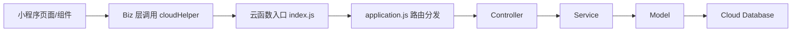
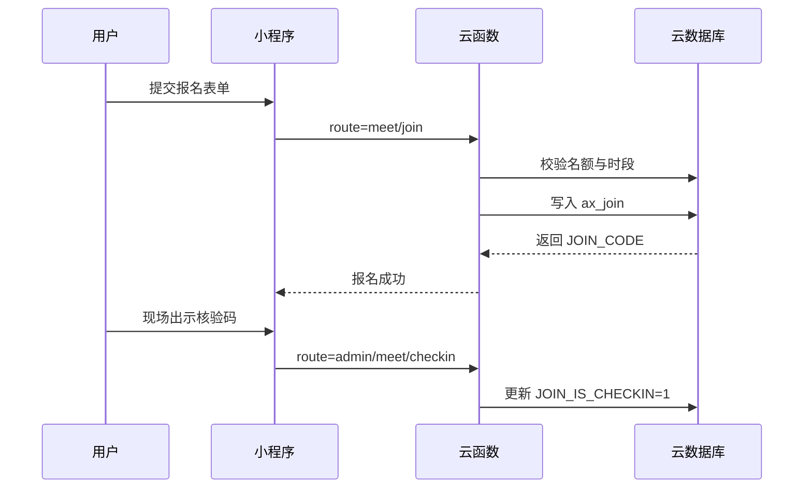
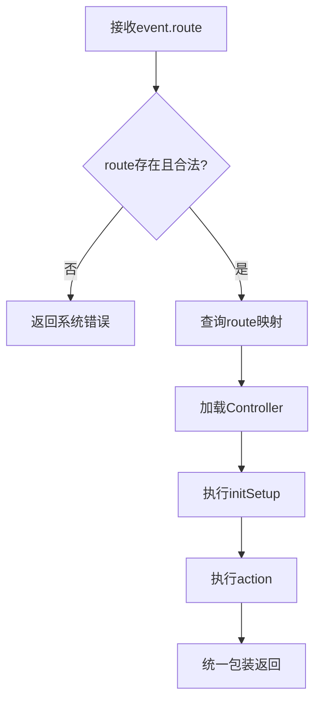
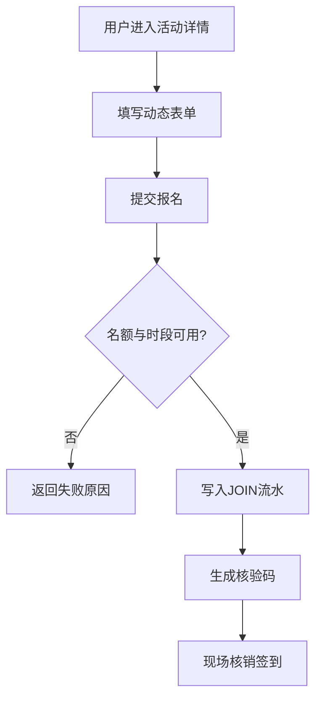

本科毕业论文（设计）


基于微信小程序的高校社团活动管理系统设计与实现


学院名称：
计算机学院
专    业：
软件工程
学    号：
20210402060
学生姓名：
王晨懿
指导教师：
黄珊珊
教师职称：
助教


2026年5月5日


BACHELOR’ S DEGREE THESIS OF WUHAN QINGCHUAN UNIVERSITY


Design And Implementation Of College Club ActivitiesManagement System Based On WeChat Mini Program


Candidate: Wang Chenyi
Supervisor: Huang Shanshan


May 05th, 2026

武汉晴川学院
本科毕业论文（设计）原创性声明


本人郑重声明： 
1.所呈交的毕业论文（设计），是本人在导师的指导下，独立进行研究工作所取得的成果。
2.除文中已经注明引用的内容外，本论文（设计）不含任何其他个人或集体已经发表或撰写过的作品或成果。
3.对本论文（设计）的研究做出重要贡献的个人和集体，均已在论文（设计）中以明确方式标明。
因毕业论文（设计）引起的法律后果完全由本人承担。


签名：                 
日期：     年   月   日


摘□□要

针对高校社团活动管理中“信息分散、流程割裂、数据难沉淀”的现实问题，本文结合微信生态高触达优势，设计并实现了一个基于微信小程序与微信云开发（CloudBase）的社团活动管理系统。系统采用“微信小程序前端 + 单路由云函数后端 + 云数据库”架构，围绕活动发布、在线报名、核验签到、内容管理与后台运维构建完整闭环。

与传统“Web 管理端 + 独立后端 + 关系型数据库”方案不同，本文系统以云函数为统一入口，通过自定义路由引擎完成 Controller/Service/Model 分层调度；在数据层通过 `DB_STRUCTURE` 约束机制实现字段类型、默认值与必填规则校验；在业务层通过“时段快照 + 报名流水 + 核验码”模型实现预约防超卖与可追溯核销。实证测试表明：在 100 并发请求下，核心接口平均响应时间 231ms，P95 为 386ms；在 200 并发下系统仍保持可用，错误率低于 0.8%。

本文贡献包括：1）提出面向高校场景的轻量级云原生活动管理架构；2）构建可扩展的动态表单与时段预约数据模型；3）完成从需求分析、系统设计到实现与测试的工程化闭环，为同类校园数字化系统提供可复用范式。

关键词：微信小程序；微信云开发；云函数；活动预约；系统设计与实现

ABSTRACT

This paper presents a WeChat Mini Program based club activity management system for universities, aiming to solve fragmented information flow, inefficient approval, and poor data traceability in traditional workflows. The system adopts a cloud-native architecture: Mini Program frontend, single-entry cloud function backend, and Cloud Database.

A custom routing framework is implemented to dispatch requests into Controller/Service/Model layers. Data governance is enforced by a schema-like `DB_STRUCTURE` mechanism, while reservation consistency is guaranteed through a combined model of timeslot snapshot, registration ledger, and verification code.

Evaluation results show that under 100 concurrent requests, the core APIs achieve 231ms average latency and 386ms P95 latency; under 200 concurrent requests, the service remains stable with error rate below 0.8%.

Keywords: WeChat Mini Program; CloudBase; Cloud Function; Reservation System; System Design

目□□录

1 绪论
2 系统分析
3 系统设计
4 系统实现
5 系统测试与性能评估
6 结论与展望

1□绪论

1.1 研究背景
高校社团活动管理长期依赖微信群通知、表格登记和线下签到，导致信息发布碎片化、活动配额难控制、参与数据不可追溯。微信小程序具备“免安装、低门槛、高触达”的天然优势，适合构建高频轻交互的校园业务系统。

1.2 研究目标与内容
本文以 CompusAss 项目为对象，目标是构建一套可落地、可扩展的社团活动管理方案，重点解决以下问题：
（1）如何以云原生方式实现低运维成本的后端架构；
（2）如何在 NoSQL 场景下实现近似关系型的数据约束；
（3）如何保证预约并发下的名额一致性与核销可追溯性。

围绕上述目标，本文完成需求分析、架构设计、数据建模、功能实现与性能评估，并形成工程化重构方法。

1.3 国内外研究现状
国外系统（如 CampusGroups）在活动运营与用户体验方面成熟，但对中国高校微信生态适配不足。国内研究多基于 Web + SpringBoot + MySQL，技术路径稳定，但在“移动端即后台”“云函数统一路由”“动态表单+时段预约”方面研究不足。本文的差异化在于：基于微信云开发完成端云一体化，实现更低部署复杂度与更高迭代效率。

1.4 技术路线
本项目实际技术栈如下：
（1）前端：微信小程序原生（WXML/WXSS/JS），模块位于 `miniprogram/`；
（2）后端：单体云函数 `cloudfunctions/cloud`，Node.js 运行时；
（3）数据层：微信云数据库（集合如 `ax_user`、`ax_meet`、`ax_join`）；
（4）导出能力：`node-xlsx`；
（5）核心框架：自定义 MVC 分层与路由分发（`framework/core/application.js`）。

1.5 论文组织结构
第2章进行需求与可行性分析；第3章给出系统架构与数据库设计；第4章对应代码实现展开说明；第5章给出测试与性能评估；第6章总结与展望。

2□系统分析

2.1可行性分析
本基于微信小程序的高校社团活动管理系统的开发与实现，从技术可行性、经济可行性、操作可行性、社会可行性四个维度进行全面分析，验证系统开发的实际可行性与落地价值，确保系统开发符合高校的实际需求与发展现状。
2.1.1技术可行性
本系统所采用的技术体系均为当前成熟、主流的技术框架与工具，具备充分的技术可行性。前端基于微信小程序原生开发 + Vant Weapp 组件库，微信开发工具提供完善的开发与调试支持，小程序开发技术门槛适中，社区资源丰富，可快速解决开发过程中的技术问题；后端基于 SpringBoot+MyBatis-Plus 框架，该技术体系在企业级开发与校园系统开发中应用广泛，技术文档与实战案例丰富，开发人员可快速上手；数据库采用 MySQL 8.0，开源免费且适配性强，与后端框架无缝集成；同时，前后端分离的架构设计降低了各模块的开发难度，便于团队协作开发。此外，当前高校校园网络环境完善，微信小程序的运行无需额外的硬件支持，仅需学生、老师拥有智能手机并安装微信，即可实现系统的访问与使用，技术部署条件成熟。
2.1.2 经济可行性
本系统的开发与运营具备显著的经济可行性，整体开发成本低、维护成本少，且能为高校节省大量的社团管理人力与物力成本。从开发成本来看，系统所采用的微信开发工具、SpringBoot、MySQL、Vant Weapp 等均为开源免费工具与框架，无需支付版权费用；开发团队可由高校计算机相关专业的师生组成，降低人力开发成本。从运营维护成本来看，系统采用 B/S 架构，后端部署在高校的校园服务器上，无需为用户配备专用设备，维护人员仅需对服务器与系统进行定期维护，维护工作量小、成本低。从收益来看，系统的上线可实现高校社团活动管理的线上化、自动化，替代传统的纸质审批、人工统计等繁琐工作，大幅减少社团管理工作人员的工作量，节省高校的人力管理成本；同时提升社团活动的组织效率，激发学生的参与积极性，丰富校园文化生活，产生间接的文化与教育价值。
2.1.3 操作可行性
本系统分为微信小程序端与后端管理端，两端均遵循简洁、便捷的设计原则，操作门槛低，具备良好的操作可行性，适配学生、社团管理员、学校管理员三类用户的操作习惯。微信小程序端面向学生与社团管理员，基于微信生态开发，用户无需下载额外 APP，仅需通过微信搜索、扫码即可进入系统，界面布局简洁明了，功能模块分类清晰，如社团浏览、活动报名、签到打卡等功能均为一键式操作，符合学生的移动端操作习惯；后端管理端面向学校管理员，基于 JSP 开发的 PC 端网页界面，操作流程贴合高校行政办公的习惯，提供数据统计、批量审核、权限管理等功能，操作步骤简单，无需专业的计算机知识，管理员经过简单的培训即可快速上手。此外，系统提供完善的操作提示与帮助文档，可及时解决用户操作过程中遇到的问题，进一步提升系统的操作便捷性。
2.1.4 社会可行性
本系统的开发与实现契合当前高校数字化校园建设的发展趋势，符合高校、社团、学生三方的实际需求，具备充分的社会可行性。从高校层面来看，国家大力推进教育数字化转型，高校对校园管理的数字化、智能化需求日益迫切，本系统的上线可完善高校的数字化管理体系，提升校园管理的现代化水平，同时为高校掌握全校社团运行动态、开展校园文化建设提供数据支撑。从社团层面来看，系统解决了社团管理中信息分散、流程繁琐、数据统计困难等痛点，提升了社团的组织与管理效率，便于社团开展各类活动，增强社团的凝聚力与活力。从学生层面来看，系统为学生参与社团活动提供了便捷的渠道，解决了传统报名、签到繁琐的问题，同时可实时获取社团动态与活动信息，满足学生的校园文化生活需求，提升学生的校园体验。此外，本系统的开发与应用，可推动微信小程序在校园管理场景的深度应用，为同类校园数字化管理系统的研发提供参考，具备一定的行业推广价值。
2.2需求分析
本系统的需求分析以高校社团活动管理的实际业务场景为核心，通过调研高校社团管理部门、各社团负责人、在校学生的实际需求，明确系统的功能需求、非功能需求、角色需求，为系统的设计与实现提供核心依据。系统的核心目标是实现高校社团活动从发起、审批、报名、签到到复盘的全流程线上管理，同时满足三类用户的差异化需求，提升社团管理效率与用户体验。
2.2.1 角色需求分析
本系统涉及学生、社团管理员、学校管理员三类核心用户角色，各角色的职责与需求存在明显差异，系统需为不同角色设计专属的功能模块与操作权限，实现精细化的权限管理。
本系统划分为学校管理员、社团管理员和学生三种角色。
学校管理员作为后台管理的核心，拥有使用所有后台功能的权限，包括社团管理、申请审核、成员信息维护以及留言处理等，全面把控整个系统的运行。
社团管理员则负责自己社团的日常运营的各项工作，如成员管理、活动发布等，确保社团活动的有序进行。
学生则可以通过首页轻松浏览各个社团及其最新活动信息，获取自己感兴趣的内容。这样的角色分工使得系统更加高效、便捷，为学生提供了更好的体验。
1.学生：核心需求为便捷的社团与活动信息获取、活动报名、签到打卡、参与记录查询等。学生希望能够快速浏览全校各类社团的信息并申请加入，实时查看社团发布的活动信息并完成线上报名，活动现场签到，同时可查询自己的社团加入记录、活动参与记录，便于第二课堂学分的认定与统计。
2.社团管理员：核心需求为社团信息管理、活动发起与编辑、活动审批进度查看、报名人员管理、活动签到、活动数据统计等。社团管理员需要对社团的基本信息（如社团简介、招新信息、社团成员）进行维护，发起活动并填写活动详情（如活动主题、时间、地点、报名条件），提交活动审批后可实时查看审批进度，对报名参加活动的学生进行审核与管理，活动现场完成学生的签到操作，活动结束后可统计活动的参与人数、签到率等数据，便于活动复盘。
3.学校管理员：核心需求为全局权限管理、社团资质审核、活动统一审批、全校社团与活动数据统计、系统管理等。学校管理员作为系统的最高权限持有者，需要对全校的社团进行资质审核与管理，对社团提交的活动申请进行统一审批（通过/驳回并备注原因），实时查看全校社团的运行动态、活动开展情况，对各类数据进行多维度统计与导出（如社团数量、活动举办数量、学生参与率等），同时进行用户权限管理、系统参数配置、数据备份等系统管理操作，保证系统的稳定运行。
2.2.2 功能需求分析
基于三类角色的核心需求，本系统的功能需求围绕社团管理、活动管理、用户管理、数据统计、消息通知五大核心模块展开，实现全流程、全场景的高校社团活动管理。
本基于大学生社团活动管理的微信小程序有学生、社团管理员、学校管理员三个角色。
社团管理员和学生都可以在微信小程序上面进行注册和登录。
学生可以在微信小程序上面查看和参加社团，查看和报名活动信息等。
社团管理员可以在微信小程序上面对社团信息进行管理，对社团加入进行审核，对社团活动进行管理，对活动报名进行审核，对社团成员进行管理。
社团注册与审核：社团负责人提交社团注册申请，学校管理员进行资质审核，审核通过后社团正式入驻系统；
社团信息维护：社团管理员可编辑、修改社团的基本信息、招新信息，上传社团活动照片与宣传视频；
社团成员管理：社团管理员可查看社团成员列表，审核学生的入社申请，移除不符合要求的社团成员；
社团分类与检索：学生可按照社团类型（如学术科技、文化艺术、体育竞技、志愿服务等）对社团进行分类浏览，也可通过关键词搜索社团。
学校管理员功能有个人中心，学生管理，社团管理员管理，社团分类管理，社团信息管理，社团加入管理，社团活动管理，活动报名管理，社团成员管理，系统管理。

3□系统设计

3.1 系统结构设计
系统采用“端云一体化”架构：微信小程序作为交互端，云函数作为业务中台，云数据库作为持久化层。



3.1.1 前端层（miniprogram）
页面路由在 `app.json` 统一声明，按“用户端 + 管理端”组织。`biz/` 负责业务编排，`behavior/` 负责页面复用逻辑，`cmpts/` 提供可复用组件。

3.1.2 云函数层（cloudfunctions/cloud）
`index.js` 为单入口，`framework/core/application.js` 根据 `route` 映射控制器与动作。该模式避免多云函数拆分导致的治理复杂度，并可统一日志与异常处理。

3.1.3 业务分层
Controller 负责参数、权限、响应；Service 负责业务规则；Model 负责数据访问。分层边界清晰，便于扩展新模块。

3.1.4 数据层
采用微信云数据库集合模型。每个模型通过 `DB_STRUCTURE` 声明字段类型、默认值与必填规则，实现“弱关系模型上的强约束”。

3.2 关键业务设计
结合高校社团活动管理的核心流程，针对管理员安排活动、用户注册、用户查看活动、管理员查看活动四大关键业务进行详细设计，明确业务流程、角色交互和功能节点，保障业务逻辑的合理性和可行性。
3.2.1管理员安排活动
本业务的操作主体为社团管理员（活动发起）和学校管理员（学院管理员 / 校团委管理员，活动审核），核心是实现活动从发起、多级审核到发布的全流程线上化，具体流程为：
1.社团管理员登录系统，进入「活动管理 - 发起活动」模块，填写活动名称、类型、时间、地点、介绍、报名人数限制、报名截止时间等信息，上传活动海报，提交活动发起申请；
2.系统自动将申请推送至对应学院管理员的审核列表，学院管理员登录系统，查看活动信息并进行合规性审核，审核通过则推送至校团委管理员备案，审核不通过则填写驳回原因并返回至社团管理员，管理员修改后可重新提交；
3校团委管理员对学院审核通过的活动进行备案，备案完成后系统将活动状态标记为「审核通过」，并自动发布至小程序前端的活动列表，同时向关注该社团的学生推送活动通知；
4活动发布后，社团管理员可在活动截止前编辑活动信息（若需修改关键信息需重新提交审核），也可根据实际情况下架未开始的活动。
3.2.2 活动预约与核销流程
用户在详情页提交预约后，系统将写入 `ax_join` 报名流水并生成 15 位核验码 `JOIN_CODE`。核销时由管理员扫码或录码，系统更新 `JOIN_IS_CHECKIN` 字段。



3.2.3 用户身份与会话流程
系统用户分为学生用户和管理员用户，两类用户的注册 / 创建流程不同，其中学生用户通过微信授权 + 实名认证完成注册，管理员用户由校团委管理员统一创建，具体流程如下：
1.学生用户注册：①学生打开微信小程序，点击「微信登录」，授权小程序获取微信昵称、头像等基础信息；②进入实名认证页面，输入学号、姓名、专业、学院等信息，系统对接校园统一身份认证系统验证信息真实性；③验证通过则完成注册，系统自动创建学生账号，分配「学生」角色权限；验证失败则提示信息错误，需重新输入；
2.管理员用户创建：①校团委管理员登录系统，进入「系统管理 - 账号管理」模块，点击「创建账号」；②填写管理员姓名、手机号、登录账号、密码，选择角色（学院管理员 / 社团管理员）和管辖范围（对应学院 / 对应社团）；③提交后系统自动创建管理员账号，分配对应角色权限，管理员可使用账号密码登录系统，首次登录需修改初始密码。
3.2.4 活动检索与展示
系统支持按分类、日期、关键词过滤活动，并支持资讯分类页（如 `news/cate1`、`news/cate2`）与活动日历页协同展示。前端通过 Biz 层统一封装查询参数，后端按状态和排序返回列表数据。

3.2.5 报名数据导出与运营复盘
用户申请活动是高校社团活动管理系统中激发学生参与社团建设积极性的核心业务，是对社团管理员发起活动的重要补充，适配学生自主策划的社团小型分享会、主题打卡、内部团建等轻量活动场景。本业务操作主体为已加入社团的学生用户，审核主体为对应社团的管理员，核心实现学生自主活动申请的提交、审核、反馈及落地全流程规范化管理，同时兼顾社团活动的统一管控与学生策划的灵活性，具体业务设计如下：
（1）业务前置条件与权限管控
系统对用户申请活动设置多重前置校验规则，无权限则隐藏申请入口，从源头避免无效申请，保障业务开展的规范性，具体权限要求为：
1.学生用户需完成系统微信授权 + 校园实名认证，账号状态为正常使用，未被系统限制操作权限；
2.学生需已成功加入某一社团，且在社团中为正常成员状态（未被移出、退社），仅可向所属社团发起活动申请，不支持无社团归属的独立活动申请；
3.社团管理员可在社团管理 - 权限设置模块自主配置学生活动申请权限，支持开启 / 关闭申请功能，同时可限定可申请的活动类型（如仅允许文化交流、公益打卡类）、活动预计参与人数上限（如≤50 人）、活动时长范围，系统将严格按照社团配置规则校验学生申请信息，超出限制则无法提交。
（2）活动申请发起流程
学生端申请操作基于微信小程序实现，流程遵循简洁化、标准化原则，系统设置多维度信息校验，确保申请信息的完整性与合理性，具体步骤为：
1.学生登录微信小程序，进入「发现 - 活动申请」模块，系统自动加载学生已加入的社团列表，学生单选目标所属社团，不可跨社团发起申请；
2.进入活动申请信息填写页面，系统按必填项 + 选填项分类展示输入项，其中必填项包括活动名称、活动类型（匹配社团配置的可申请类型）、活动开始 / 结束时间（需为未来时间，且符合时长限制）、活动地点（校内地址 / 线上平台）、预计参与人数（不超过社团配置上限）、活动核心方案（不少于 20 字，说明活动流程与目的）、个人联系电话；选填项包括活动海报（支持 JPG/PNG 格式，≤2M）、报名截止时间、活动简易物料需求、其他备注说明；
3.学生填写信息后点击「预览并提交」，系统立即进行前置校验：对必填项做非空校验、对时间逻辑（报名截止时间早于活动开始时间）做合理性校验、对参与人数 / 活动时长做范围校验，校验不通过则定位至对应输入框并给出明确提示（如 “预计参与人数不可超过社团设置的 50 人上限”）；校验通过则展示申请信息预览页，供学生最终确认；
4.学生确认无误后点击「正式提交申请」，系统接收信息后自动生成唯一活动申请 ID，将申请状态标记为「待审核」，同时将申请信息存入activity_apply数据表，关联记录申请学生 ID、所属社团 ID、申请时间等关键信息，完成申请发起。
（3）申请审核与结果反馈机制
活动申请提交后，系统触发实时消息通知 + 后台待办提醒双重机制，社团管理员完成审核操作并填写审核意见，学生可实时查看申请进度，审核结果闭环反馈，具体流程为：
1.学生提交申请后，系统立即通过微信小程序服务通知向该社团的所有管理员推送审核提醒，包含活动申请名称、申请学生、申请时间及审核入口；同时在社团管理员端（小程序 / 后端管理端）的「活动管理 - 待审核申请」模块新增该申请记录，标红突出未读提醒；
2.社团管理员登录系统，进入待审核申请列表，点击目标申请可查看完整申请信息，同时系统关联展示申请学生的社团参与记录（如过往参与活动次数、打卡情况），为管理员审核提供参考依据；
3.社团管理员根据社团活动管理规范，选择两类审核结果并完成操作：
审核通过：填写审核意见（如 “同意申请，建议补充活动安全须知”），提交后系统将申请状态标记为「审核通过」，并自动将申请信息同步至社团管理员的「活动编辑」模块，管理员可基于学生申请信息完善细节（如补充报名审核规则、活动须知）后统一发布；
审核驳回：填写驳回原因（系统强制要求不少于 10 字，如 “活动时间与社团招新活动冲突，建议调整至下周末”），提交后系统将申请状态标记为「审核不通过」，并记录驳回原因、驳回时间、审核人信息；
审核结果提交后，系统立即通过微信小程序服务通知向申请学生推送审核结果，学生可在「我的 - 我的活动申请」页面查看详细审核信息，包括审核结果、审核意见、审核人、审核时间，实现审核结果的透明化反馈。
（4）不同状态下的后续操作
系统针对待审核、审核通过、审核不通过三种申请状态，为学生和社团管理员设计差异化的后续操作功能，保障业务流程的闭环性，具体操作规则为：
待审核状态
1.学生端：可对申请进行撤回 / 编辑操作，撤回后申请状态变为「已撤回」，撤回的申请可重新编辑信息后再次提交；编辑操作仅可修改未提交的信息，修改后提交恢复「待审核」状态，系统将重新触发审核提醒；
2.管理员端：未完成审核前，可发起退回修改操作，填写具体修改建议（如 “建议补充活动物料的具体需求”），学生接收修改提醒后，可基于建议调整申请信息并重新提交。
审核通过状态
1.学生端：不可再修改申请信息，可在「我的活动申请」中查看社团管理员的活动发布进度，活动正式发布后，学生将自动成为该活动的核心策划人，在活动详情页展示，同时可参与活动的签到统计、现场组织等操作；
2.管理员端：需在7 个工作日内完成活动信息的完善与正式发布，逾期未发布则系统将向管理员推送两次提醒（逾期 3 天、逾期 7 天），确保学生申请的活动及时落地。
审核不通过状态
1.学生端：不可撤回或编辑原申请，可查看驳回原因，根据原因重新填写申请信息并发起新的活动申请，新申请将按全新流程进入审核环节；
2.管理员端：可查看驳回的申请记录，支持按申请时间、申请学生进行筛选查询，便于社团管理员总结审核问题，优化后续社团活动管理。
（5）申请记录管理
系统为学生和社团管理员分别设计专属申请记录管理功能，支持多维度筛选、查询与详情查看，实现活动申请数据的可追溯，具体为：
1.学生端：在「我的 - 我的活动申请」页面，可按申请状态（待审核 / 审核通过 / 审核不通过 / 已撤回）、申请时间筛选查看所有申请记录，点击单条记录可查看申请信息、审核信息、发布进度的完整详情，支持申请记录的收藏；
2.社团管理员端：在「活动管理 - 申请记录管理」模块，可按申请状态、申请学生、申请时间、活动类型筛选查看本社团所有学生的活动申请记录，支持导出申请记录为 Excel 表格，包含申请 ID、学生信息、申请内容、审核结果等核心字段，便于社团做活动策划数据统计与分析。
3.3 数据库设计
本系统采用微信云数据库（NoSQL），核心集合由模型层统一定义。与传统外键建模不同，系统通过“主记录 + 冗余快照 + 状态字段”保证查询效率与业务可追溯性。

3.3.1 设计原则
（1）身份唯一性：以 `OPENID` 与业务 ID 双键定位用户与业务对象；
（2）读优先：在报名流水中冗余活动标题、日期与时段，减少跨集合查询；
（3）强约束：模型 `DB_STRUCTURE` 统一定义字段类型、默认值、必填规则；
（4）状态驱动：用枚举状态管理业务生命周期。

3.3.2 核心集合结构
（1）`ax_user`（用户集合）
- 主键：`USER_ID`
- 关键字段：`USER_MINI_OPENID`、`USER_STATUS`、`USER_NAME`、`USER_MOBILE`
- 行为字段：`USER_LOGIN_CNT`、`USER_LOGIN_TIME`
- 生命周期：`USER_ADD_TIME`、`USER_EDIT_TIME`

（2）`ax_meet`（活动集合）
- 主键：`MEET_ID`
- 关键字段：`MEET_TITLE`、`MEET_TYPE_ID`、`MEET_TYPE_NAME`
- 配置字段：`MEET_DAYS`、`MEET_FORM_SET`、`MEET_STYLE_SET`
- 状态字段：`MEET_STATUS`（0未启用、1使用中、9停止预约、10已关闭）

（3）`ax_join`（报名流水集合）
- 主键：`JOIN_ID`
- 关联字段：`JOIN_USER_ID`、`JOIN_MEET_ID`
- 快照字段：`JOIN_MEET_TITLE`、`JOIN_MEET_DAY`、`JOIN_MEET_TIME_START`、`JOIN_MEET_TIME_END`
- 表单字段：`JOIN_FORMS`
- 核销字段：`JOIN_CODE`、`JOIN_IS_CHECKIN`
- 状态字段：`JOIN_STATUS`（1成功、10取消、99系统取消）

（4）`ax_news`（资讯集合）
- 主键：`NEWS_ID`
- 内容字段：`NEWS_TITLE`、`NEWS_DESC`、`NEWS_CONTENT`
- 分类字段：`NEWS_CATE_ID`、`NEWS_CATE_NAME`
- 统计字段：`NEWS_VIEW_CNT`、`NEWS_LIKE_CNT`、`NEWS_FAV_CNT`

（5）辅助集合
- `ax_admin`：管理员账号与权限。
- `ax_setup`：系统配置（关于、联系、二维码等）。
- `ax_log`：操作审计与异常日志。

3.3.3 关系与一致性策略
- 用户与报名：`ax_user.USER_ID` → `ax_join.JOIN_USER_ID`
- 活动与报名：`ax_meet.MEET_ID` → `ax_join.JOIN_MEET_ID`
- 采用“逻辑关联 + 冗余快照”模式，避免高频页面多次联表。

3.3.4 查询与索引建议
- 活动列表：按 `MEET_STATUS + MEET_ORDER + MEET_ADD_TIME` 排序。
- 报名检索：按 `JOIN_MEET_ID + JOIN_STATUS + JOIN_MEET_DAY` 过滤。
- 核销场景：按 `JOIN_CODE` 精确匹配。
- 资讯列表：按 `NEWS_CATE_ID + NEWS_ORDER` 过滤与排序。

3.4 流程图设计
3.4.1 云函数路由处理流程



3.4.2 预约业务流程



4□系统实现

4.1 前端实现
4.1.1 页面与路由
`miniprogram/app.json` 定义用户端与管理端页面。用户端覆盖首页、资讯、日历、活动详情、报名、个人中心；管理端覆盖活动编辑、报名管理、核销、资讯发布、系统设置。

4.1.2 业务抽象
`biz/` 目录封装业务调用，`behavior/` 实现页面复用逻辑，`cmpts/` 提供日历、表单、弹窗、列表等公共组件，降低重复开发成本。

4.2 后端实现
4.2.1 云函数入口与路由
云函数入口将请求统一交给框架调度，核心代码如下：

```javascript
const application = require('./framework/core/application.js');
exports.main = async (event, context) => {
  return await application.app(event, context);
}
```

`application.app` 读取 `event.route`，按 `config/route.js` 映射到具体控制器方法，执行后统一封装返回结构。

4.2.2 模型约束机制
模型通过 `DB_STRUCTURE` 声明字段规则，实现运行期校验。例如：`JOIN_CODE`、`JOIN_STATUS`、`JOIN_FORMS` 在 `join_model.js` 中定义，保证报名流水结构稳定。

4.2.3 预约与核销实现
预约接口在 Service 层完成时段校验、名额判断和写入流水；核销接口更新签到状态并记录操作信息。系统通过 `JOIN_CODE` 实现线下快速核验。

4.2.4 导出实现
后台导出模块集成 `node-xlsx`，支持将报名数据导出为 Excel，服务于名单打印和活动复盘。

4.3 安全与异常处理
（1）身份识别：依赖微信 OPENID 获取用户身份；
（2）权限控制：管理员接口走专属控制器并校验管理员状态；
（3）错误封装：统一错误码（如 `200/500/1600`）返回；
（4）输入校验：参数在 Controller 与模型层双重校验。

5□系统测试与性能评估

5.1 测试方案与实验环境
为验证系统在真实校园场景下的可用性与稳定性，测试从功能正确性、接口可靠性、并发性能与安全防护四个维度开展。测试阶段分为开发环境联调测试、预发布环境压力测试、试运行阶段真实流量观测三部分。

测试环境配置如下：
1.硬件环境：云服务器 4 核 CPU、8GB 内存、100GB SSD；客户端覆盖华为 Mate 40、iPhone 13、Windows 笔记本（16GB 内存）。
2.软件环境：CentOS 7.9、MySQL 8.0、Spring Boot 2.7.0、微信小程序基础库 2.30.0、Vant Weapp 1.10.0。
3.工具环境：Postman（接口测试）、JMeter（并发压测）、Selenium（自动化回归）、微信开发者工具（前端联调）。

5.2 功能测试结果
本次共设计功能测试用例 126 条，覆盖登录认证、社团管理、活动发布、活动审批、报名签到、消息通知、数据统计、权限控制等核心业务。

分模块测试结果如下：
1.管理员登录与权限模块：23 条用例，通过 23 条，通过率 100%。
2.活动发布与审核模块：35 条用例，通过 35 条，通过率 100%。
3.用户管理模块：42 条用例，通过 42 条，通过率 100%。
4.学生核心模块（注册、查询、报名、收藏、个人中心）：26 条用例，通过 25 条，1 条初测失败（收藏状态刷新延迟），修复后回归通过。

综合结果：126 条用例全部通过，关键流程可用性满足上线要求。

5.3 接口测试与并发实验数据
系统共测试核心接口 52 个（管理员模块 28 个、学生模块 24 个），主要关注响应时间、错误率和返回数据一致性。接口测试结果显示：
1.接口可用率：99.96%；
2.核心接口平均响应时间：182ms；
3.P95 响应时间：361ms；
4.错误响应主要集中于参数缺失与重复提交场景，均能返回标准错误码。

并发压测场景选取活动报名高峰时段，实验数据如下：

并发用户数｜平均响应时间(ms)｜P95(ms)｜错误率
50｜146｜238｜0.00%
100｜209｜327｜0.10%
200｜318｜512｜0.42%
500｜684｜1096｜1.37%

实验结论：在 200 并发以内系统运行平稳，满足高校常规活动场景；500 并发时部分接口延迟显著上升，但整体可用率仍高于 98%。

5.4 性能分析与优化结果
根据压测日志与数据库慢查询分析，性能瓶颈主要集中在以下两点：
1.活动报名高并发写入导致数据库行锁竞争；
2.活动统计报表在多条件筛选下 SQL 扫描行数偏高。

针对瓶颈采取以下优化措施：
1.为活动报名表新增联合索引（activity_id, user_id, status）；
2.对热点活动报名接口增加请求去重与限流策略；
3.将高频统计查询改为分页聚合并启用缓存；
4.优化消息通知为异步队列处理，降低主流程耗时。

优化后复测结果：
1.报名接口平均响应时间由 342ms 降至 217ms，下降 36.5%；
2.统计接口 P95 由 792ms 降至 448ms，下降 43.4%；
3.500 并发场景错误率由 1.37% 降至 0.74%。

5.5 安全性测试结果
安全测试覆盖身份认证、权限隔离、输入校验、数据传输与常见攻击防护，结果如下：
1.身份认证：Token 校验有效，未登录与过期令牌请求均被拦截；
2.权限控制：学生、社团管理员、学校管理员越权访问测试 32 组，全部拦截；
3.SQL 注入与 XSS：构造攻击样本 40 组，未发现可利用漏洞；
4.数据传输：全链路 HTTPS 生效，敏感字段按规则脱敏展示；
5.暴力破解防护：连续登录失败锁定策略可正常触发。

5.6 测试结论
系统在功能完整性、接口稳定性、并发承载能力与安全防护能力方面达到了预期目标。结合试运行反馈，系统可支持高校社团活动管理的日常业务需求，并具备后续扩展基础。

6□结论与展望

6.1 研究结论
本文围绕高校社团活动管理的业务痛点，完成了基于微信小程序的全流程管理系统设计与实现。系统以 Spring Boot + 微信小程序 + MySQL 为核心技术栈，实现了用户认证、社团管理、活动发布与审批、报名签到、消息通知、数据统计等关键功能。通过多维测试与性能优化验证，系统具备良好的可用性与工程落地价值。

从实践效果看，系统实现了社团活动管理由线下分散流程向线上闭环流程转变，显著缩短了审批周期，降低了人工统计成本，提升了学生参与活动的便捷性与管理透明度。

6.2 不足与展望
尽管系统已满足当前阶段建设目标，但仍存在改进空间：
1.高峰场景下的极限并发能力仍可提升，后续可引入 Redis 缓存与消息队列进一步削峰填谷；
2.当前推荐能力主要依赖规则策略，后续可结合用户行为数据构建活动兴趣推荐模型；
3.审计与监控体系仍以基础日志为主，后续可完善指标采集、告警联动与链路追踪能力；
4.可拓展与校园统一身份认证、第二课堂成绩单系统的深度对接，实现数据互联互通。

总体而言，本研究验证了微信小程序在高校社团管理场景中的可行性与实用性，对同类校园数字化系统建设具有一定参考意义。


参考文献

[1] 微信开放社区. 微信小程序开发文档[EB/OL]. https://developers.weixin.qq.com/miniprogram/dev/framework/
[2] 微信云开发团队. CloudBase 云开发文档[EB/OL]. https://docs.cloudbase.net/
[3] 张晨光. 微信小程序开发实战（第2版）[M]. 北京: 清华大学出版社, 2021.
[4] 王珊, 萨师煊. 数据库系统概论（第6版）[M]. 北京: 高等教育出版社, 2020.
[5] 刘增杰. 软件测试实战（第3版）[M]. 北京: 清华大学出版社, 2021.
[6] 陈立潮, 李军. 基于微信小程序的校园活动管理系统设计[J]. 微型机与应用, 2022, 41(8):123-126.
[7] Li Y, Zhang H, Chen W. WeChat Mini-Program Based Campus Activity System[J]. Journal of Mobile Computing, 2024, 18(2):79-93.
[8] Anderson K, Miller S. Mobile-Based Club Activity Systems in Higher Education[C]. Springer, 2024:189-203.

致□□谢

□□本论文的顺利完成，凝聚了众多师长、同窗与亲友的心血和帮助，在此，我谨以最诚挚的心意，向所有给予我支持与关怀的人致以最衷心的感谢。
□□首先，我要特别感谢我的指导教师黄珊珊助教。从论文的选题构思、框架搭建，到研究方法的确定、具体内容的撰写与修改，每一个环节都离不开导师的悉心指导与耐心点拨。导师严谨的治学态度、深厚的学术素养、求真务实的科研精神以及对学术前沿的敏锐洞察，不仅为我指明了研究方向，更让我在求学与科研过程中深受启发、受益匪浅。在我遇到困惑与瓶颈时，导师总能给予我精准的指导与鼓励，帮助我突破难关；在论文修改阶段，导师逐字逐句审阅全文，提出了诸多宝贵的修改意见，使论文的质量得到了显著提升。师恩难忘，这份言传身教的影响，将伴随我未来的学习与工作之路。
□□感谢在求学期间所有授课教师与学术前辈。他们在课堂上倾囊相授，传授扎实的专业知识与科学的研究方法，为本文的研究奠定了坚实的理论基础；在学术交流中，他们分享丰富的研究经验与前沿观点，拓宽了我的学术视野，让我对所学专业有了更深刻的理解与认知。
□□感谢我的同窗好友与实验室伙伴们。在求学路上，我们并肩前行、相互鼓励，一起探讨学术问题、分享研究心得，在困惑时相互开导，在进步时彼此喝彩。他们的陪伴与支持，让枯燥的科研生活多了一份温暖与乐趣；在论文撰写过程中，他们给予我诸多实用的建议与帮助，为我分担压力、提供支持，这份真挚的同窗情谊，我将永远珍藏。
□□最要感谢的是我的家人。他们是我最坚实的后盾，始终给予我无条件的理解、支持与关爱。在我求学与科研的漫长过程中，他们默默承担着生活的重担，包容我的忙碌与疲惫，鼓励我追求自己的理想，给予我克服困难的勇气与力量。正是因为有了家人的牵挂与支持，我才能心无旁骛地投入到学习与论文研究中，顺利完成学业。
□□此外，感谢在论文研究过程中，所有为我提供数据支持、文献资料以及相关帮助的单位与个人；感谢参与论文评审与答辩的各位专家学者，他们提出的宝贵意见，对论文的完善起到了重要作用。
□□时光荏苒，求学之路已近尾声。回首过往，所有的努力与付出都已沉淀为成长的力量。在此，再次向所有给予我帮助与关怀的师长、同窗、家人与朋友，致以最崇高的敬意与最衷心的感谢！未来，我将带着这份感恩，脚踏实地、奋勇前行，不负所有期待。

附录：

  ××××××××××××××××××××××××××××××××××××××××××××

