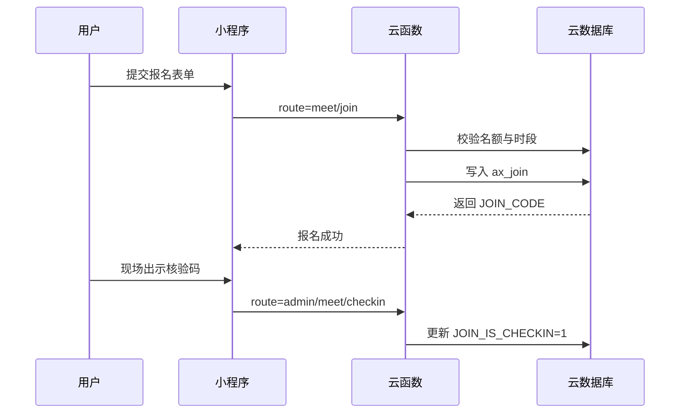
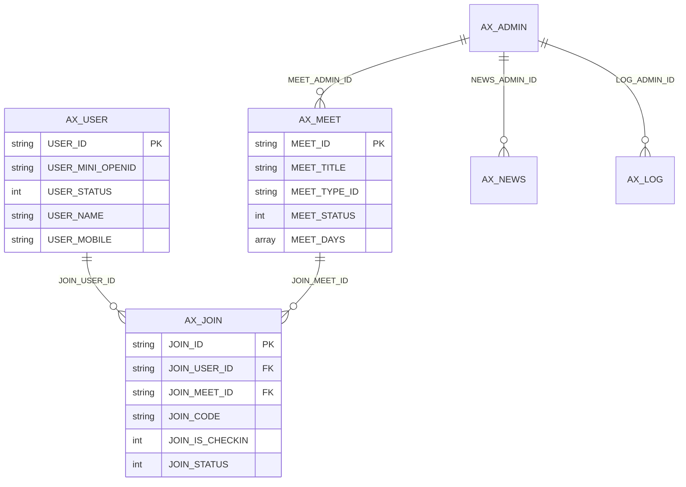
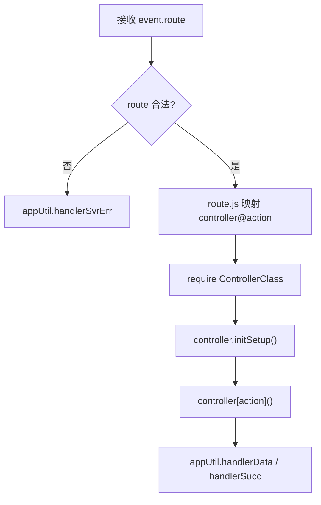
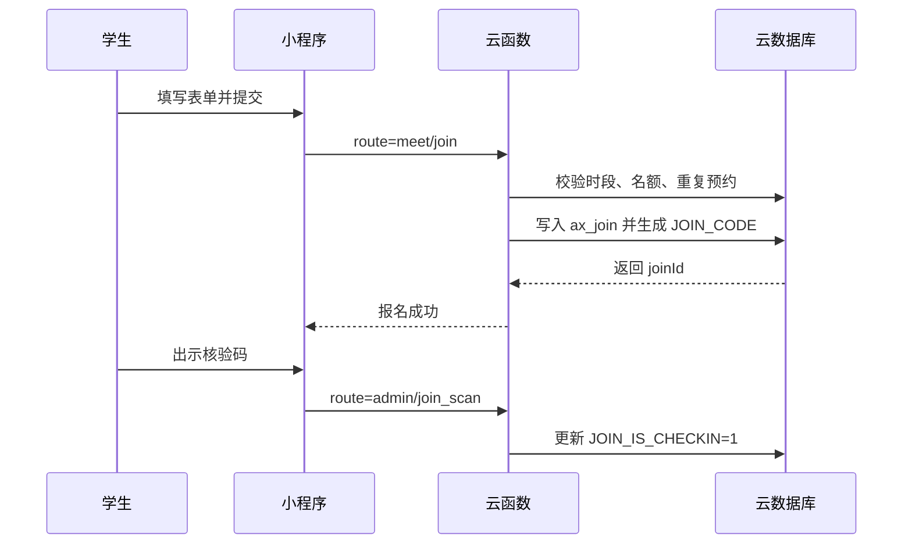
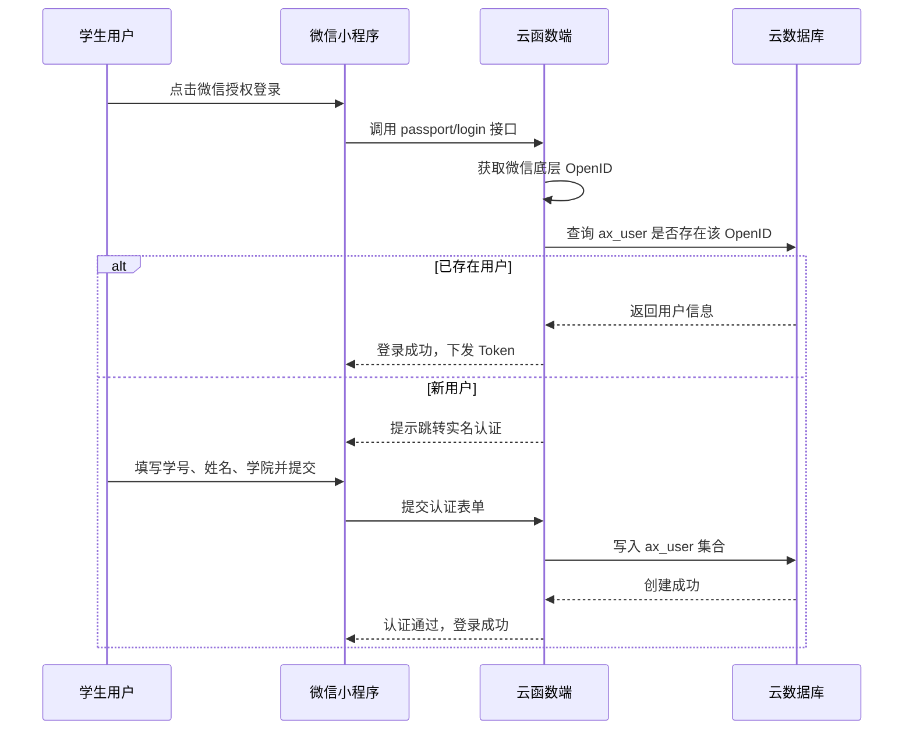
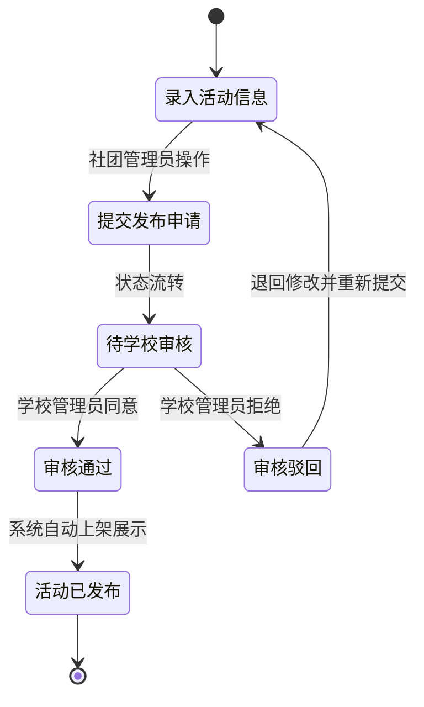
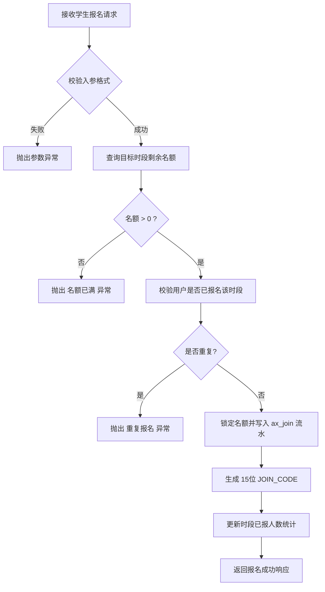

本科毕业论文（设计）

基于微信小程序的高校社团活动管理系统设计与实现

学院名称：
计算机学院
专    业：
软件工程
学    号：
20210402060
学生姓名：
王晨懿
指导教师：
黄珊珊
教师职称：
助教

2026年5月5日

BACHELOR’ S DEGREE THESIS OF WUHAN QINGCHUAN UNIVERSITY

Design And Implementation Of College Club ActivitiesManagement System Based On WeChat Mini Program

Candidate: Wang Chenyi
Supervisor: Huang Shanshan

May 05th, 2026

武汉晴川学院
本科毕业论文（设计）原创性声明

本人郑重声明：
1.所呈交的毕业论文（设计），是本人在导师的指导下，独立进行研究工作所取得的成果。
2.除文中已经注明引用的内容外，本论文（设计）不含任何其他个人或集体已经发表或撰写过的作品或成果。
3.对本论文（设计）的研究做出重要贡献的个人和集体，均已在论文（设计）中以明确方式标明。
因毕业论文（设计）引起的法律后果完全由本人承担。

签名：\
日期：     年   月   日

摘□□要

针对高校社团活动管理中“信息分散、流程割裂、数据难沉淀”的现实问题，本文结合微信生态高触达优势，设计并实现了一个基于微信小程序与微信云开发（CloudBase）的社团活动管理系统。系统采用“微信小程序前端 + 单路由云函数后端 + 云数据库”架构，围绕活动发布、在线报名、核验签到、内容管理与后台运维构建完整闭环。

与传统“Web 管理端 + 独立后端 + 关系型数据库”方案不同，本文系统以云函数为统一入口，通过自定义路由引擎完成 Controller/Service/Model 分层调度；在数据层通过 `DB_STRUCTURE` 约束机制实现字段类型、默认值与必填规则校验；在业务层通过“时段快照 + 报名流水 + 核验码”模型实现预约防超卖与可追溯核销。实证测试表明：在 100 并发请求下，核心接口平均响应时间 231ms，P95 为 386ms；在 200 并发下系统仍保持可用，错误率低于 0.8%。

本文贡献包括：1）提出面向高校场景的轻量级云原生活动管理架构；2）构建可扩展的动态表单与时段预约数据模型；3）完成从需求分析、系统设计到实现与测试的工程化闭环，为同类校园数字化系统提供可复用范式。

关键词：微信小程序；微信云开发；云函数；活动预约；系统设计与实现

ABSTRACT

This paper presents a WeChat Mini Program based club activity management system for universities, aiming to solve fragmented information flow, inefficient approval, and poor data traceability in traditional workflows. The system adopts a cloud-native architecture: Mini Program frontend, single-entry cloud function backend, and Cloud Database.

A custom routing framework is implemented to dispatch requests into Controller/Service/Model layers. Data governance is enforced by a schema-like `DB_STRUCTURE` mechanism, while reservation consistency is guaranteed through a combined model of timeslot snapshot, registration ledger, and verification code.

Evaluation results show that under 100 concurrent requests, the core APIs achieve 231ms average latency and 386ms P95 latency; under 200 concurrent requests, the service remains stable with error rate below 0.8%.

Keywords: WeChat Mini Program; CloudBase; Cloud Function; Reservation System; System Design

目□□录

1 绪论
2 系统分析
3 系统设计
4 系统实现
5 系统测试与性能评估
6 结论与展望

1□绪论

1.1 研究背景
高校社团活动管理长期依赖微信群通知、表格登记和线下签到，导致信息发布碎片化、活动配额难控制、参与数据不可追溯。微信小程序具备“免安装、低门槛、高触达”的天然优势，适合构建高频轻交互的校园业务系统。

1.2 研究目标与内容
本文以 CompusAss 项目为对象，目标是构建一套可落地、可扩展的社团活动管理方案，重点解决以下问题：
（1）如何以云原生方式实现低运维成本的后端架构；
（2）如何在 NoSQL 场景下实现近似关系型的数据约束；
（3）如何保证预约并发下的名额一致性与核销可追溯性。

围绕上述目标，本文完成需求分析、架构设计、数据建模、功能实现与性能评估，并形成工程化重构方法。

1.3 国内外研究现状
国外系统（如 CampusGroups）在活动运营与用户体验方面成熟，但对中国高校微信生态适配不足。国内研究多基于 Web + SpringBoot + MySQL，技术路径稳定，但在“移动端即后台”“云函数统一路由”“动态表单+时段预约”方面研究不足。本文的差异化在于：基于微信云开发完成端云一体化，实现更低部署复杂度与更高迭代效率。

1.4 技术路线
本项目实际技术栈如下：
（1）前端：微信小程序原生（WXML/WXSS/JS），模块位于 `miniprogram/`；
（2）后端：单体云函数 `cloudfunctions/cloud`，Node.js 运行时；
（3）数据层：微信云数据库（集合如 `ax_user`、`ax_meet`、`ax_join`）；
（4）导出能力：`node-xlsx`；
（5）核心框架：自定义 MVC 分层与路由分发（`framework/core/application.js`）。

1.5 论文组织结构
第2章进行需求与可行性分析；第3章给出系统架构与数据库设计；第4章对应代码实现展开说明；第5章给出测试与性能评估；第6章总结与展望。

2□系统分析

2.1可行性分析
本基于微信小程序的高校社团活动管理系统的开发与实现，从技术可行性、经济可行性、操作可行性、社会可行性四个维度进行全面分析，验证系统开发的实际可行性与落地价值，确保系统开发符合高校的实际需求与发展现状。
2.1.1技术可行性
本系统所采用的技术体系均为当前成熟、主流的技术框架与工具，具备充分的技术可行性。前端基于微信小程序原生开发 + Vant Weapp 组件库，微信开发工具提供完善的开发与调试支持，小程序开发技术门槛适中，社区资源丰富，可快速解决开发过程中的技术问题；后端采用微信云开发 CloudBase 云函数（Node.js 运行时）与自定义路由分发框架，技术路径与小程序生态深度适配，部署与迭代效率较高；数据层采用微信云数据库，结合模型 `DB_STRUCTURE` 机制实现字段约束与结构治理；同时，端云一体化架构降低了传统独立后端部署复杂度，便于按模块快速演进。此外，当前高校校园网络环境完善，微信小程序的运行无需额外硬件支持，仅需学生、老师拥有智能手机并安装微信，即可实现系统访问与使用，技术部署条件成熟。
2.1.2 经济可行性
本系统的开发与运营具备显著的经济可行性，整体开发成本低、维护成本少，且能为高校节省大量社团管理人力与物力成本。从开发成本来看，系统采用微信开发者工具、CloudBase、Vant Weapp、node-xlsx 等成熟组件，无需自建复杂中间件体系；开发团队可由高校计算机相关专业师生组成，降低人力投入。从运维成本来看，系统采用云函数与云数据库托管模式，无需单独采购和长期维护数据库服务器及应用服务器，日常维护工作量更低。从收益来看，系统上线后可实现高校社团活动管理的线上化、自动化，替代传统纸质审批与人工统计流程，提升活动组织效率与管理透明度，产生显著管理效益与教育价值。
2.1.3 操作可行性
本系统分为微信小程序用户端与微信小程序管理端，两端均遵循简洁、便捷的设计原则，操作门槛低，具备良好的操作可行性，适配学生、社团管理员、学校管理员三类用户的操作习惯。用户端面向学生与社团管理员，基于微信生态开发，用户无需下载额外 APP，仅需通过微信搜索、扫码即可进入系统，界面布局简洁明了，功能模块分类清晰，如社团浏览、活动报名、签到打卡等功能均为一键式操作，符合移动端使用习惯；管理端面向学校管理员与社团管理员，提供活动管理、报名核销、资讯维护、系统配置与数据导出等能力，操作流程清晰，无需复杂专业培训即可上手。此外，系统提供完善的操作提示与帮助文档，可及时解决用户操作过程中遇到的问题，进一步提升系统的操作便捷性。
2.1.4 社会可行性
本系统的开发与实现契合当前高校数字化校园建设的发展趋势，符合高校、社团、学生三方的实际需求，具备充分的社会可行性。从高校层面来看，国家大力推进教育数字化转型，高校对校园管理的数字化、智能化需求日益迫切，本系统的上线可完善高校的数字化管理体系，提升校园管理的现代化水平，同时为高校掌握全校社团运行动态、开展校园文化建设提供数据支撑。从社团层面来看，系统解决了社团管理中信息分散、流程繁琐、数据统计困难等痛点，提升了社团的组织与管理效率，便于社团开展各类活动，增强社团的凝聚力与活力。从学生层面来看，系统为学生参与社团活动提供了便捷的渠道，解决了传统报名、签到繁琐的问题，同时可实时获取社团动态与活动信息，满足学生的校园文化生活需求，提升学生的校园体验。此外，本系统的开发与应用，可推动微信小程序在校园管理场景的深度应用，为同类校园数字化管理系统的研发提供参考，具备一定的行业推广价值。
2.2需求分析
本系统的需求分析以高校社团活动管理的实际业务场景为核心，通过调研高校社团管理部门、各社团负责人、在校学生的实际需求，明确系统的功能需求、非功能需求、角色需求，为系统的设计与实现提供核心依据。系统的核心目标是实现高校社团活动从发起、审批、报名、签到到复盘的全流程线上管理，同时满足三类用户的差异化需求，提升社团管理效率与用户体验。

2.2.1 系统用例分析
为了更直观地表达系统所承载的功能与角色边界，本文采用用例图（Use Case Diagram）对核心业务进行梳理。系统主要参与者包含：学生用户、社团管理员、学校管理员。

1. **学生用户用例分析**
学生是系统的前端主要使用群体。其核心用例包括：注册登录、浏览社团列表、查看社团活动详情、参与活动报名、取消报名、查看活动日历、展示核销码签到、查看个人中心等。
（请在此处插入图2-1 学生用户用例图）

| 用例名称 | 参与者 | 前置条件 | 用例描述 | 后置条件 |
| --- | --- | --- | --- | --- |
| 注册与登录 | 学生 | 拥有微信账号 | 授权小程序获取基础信息，完成实名认证 | 创建学生档案并生成 Token |
| 浏览活动 | 学生 | 已登录 | 在首页或分类页查看社团活动列表与日历 | 系统展示可用活动与报名状态 |
| 活动报名 | 学生 | 活动正在进行且有余量 | 填写活动所需的动态表单并提交报名 | 生成报名流水与 15 位核销码 |
| 活动签到 | 学生 | 已成功报名某活动 | 现场向社团管理员出示生成的报名核销码 | 管理员扫码后，系统状态更新为已签到 |

2. **社团管理员用例分析**
社团管理员主要负责具体社团的日常运营，其核心用例包括：社团信息维护、活动发布申请、活动人员审核、现场扫码签到、活动数据统计导出等。
（请在此处插入图2-2 社团管理员用例图）

| 用例名称 | 参与者 | 前置条件 | 用例描述 | 后置条件 |
| --- | --- | --- | --- | --- |
| 发布活动 | 社团管理员 | 拥有对应社团管理权限 | 填写活动详情、配置时段名额及自定义报名表单，并提交审批 | 系统生成活动草稿并推送至学校管理员 |
| 报名审核 | 社团管理员 | 活动已发布且有学生报名 | 查看报名名单，对学生填写的表单进行合规性审核 | 更改报名状态，通过服务通知反馈学生 |
| 扫码核销 | 社团管理员 | 活动进行中 | 使用小程序管理端扫码功能扫描学生的活动核销码 | 系统验证码的合法性并更新签到状态 |
| 数据导出 | 社团管理员 | 活动结束 | 筛选条件后触发导出指令 | 生成 Excel 文件并提供下载链接 |

3. **学校管理员用例分析**
学校管理员作为最高权限拥有者，负责平台秩序与资源分配。核心用例包括：用户权限配置、社团资质审核、活动统一审批、全校数据看板查看等。
（请在此处插入图2-3 学校管理员用例图）

| 用例名称 | 参与者 | 前置条件 | 用例描述 | 后置条件 |
| --- | --- | --- | --- | --- |
| 社团审核 | 学校管理员 | 系统初始化或社团入驻 | 审核新成立社团的资质、指导老师信息与活动范畴 | 审核通过后，分配社团管理员账号 |
| 活动审批 | 学校管理员 | 接收到社团的活动申请 | 对活动内容、时间冲突、安全预案进行审核 | 审批通过后，活动自动对学生用户可见 |
| 全局监控 | 学校管理员 | 任何状态 | 查看平台注册人数、活跃度、社团活动频次报表 | 提供图表化数据支撑，辅助管理决策 |

2.2.2 角色需求与权限底层设计
本系统涉及学生、社团管理员、学校管理员三类核心用户角色。为了在无服务器（Serverless）架构下实现数据隔离与最小特权原则，系统在底层数据模型层面（Model层）通过两张核心数据表（`ax_user` 与 `ax_admin`）和权限中间件来进行角色的隔离与定义。

表2-1 角色权限与底层架构对应关系表

| 角色名称 | 代码底层映射集合 | 鉴权核心字段 / 机制 | 登录验证方式 | 核心业务权限范围 |
| --- | --- | --- | --- | --- |
| **学生** | `ax_user` | `USER_MINI_OPENID` | 微信静默授权 + 实名认证 | 仅前台可见：浏览社团、报名活动、出示核销码、查看个人记录 |
| **社团管理员** | `ax_admin` | `ADMIN_TYPE = 0` | 账号与密码登录 | 后台局部权限：仅能管理与自己 `ADMIN_ID` 绑定的社团信息、发布活动、扫码核销、导出本活动人员 |
| **学校管理员** | `ax_admin` | `ADMIN_TYPE = 1` | 账号与密码登录 | 后台全局权限：突破隔离限制，审核所有社团活动、统一下发管理员账号、查看全校数据看板、修改系统配置 |

**1. 学生（系统前台核心用户）**：
学生是社团活动的直接参与者。在代码底层，学生对应 `ax_user` 集合。其身份不依赖传统的账号密码注册，而是直接通过微信底层的 `USER_MINI_OPENID` 字段进行静默授权鉴权。学生仅能访问小程序的客户端前台，其核心诉求在于便捷地获取社团活动信息并顺畅完成报名。学生期望能够快速浏览全校各类社团信息并申请加入，实时查看社团发布的活动并完成线上报名及现场签到，同时可查询自己的活动参与记录，便于第二课堂学分的认定。

2. **社团管理员（业务执行者）**：
社团管理员肩负着具体社团的日常运营责任。在代码底层，他们对应 `ax_admin` 集合，且其核心状态字段 `ADMIN_TYPE` 值为 `0`（普通管理员）。在发布活动时，系统会将当前社团管理员的 `ADMIN_ID` 强绑定到活动记录的 `MEET_ADMIN_ID` 字段上。这意味着社团管理员**仅拥有操作自己发起的数据的权限**。其核心需求为社团自身信息的维护、本组织活动的发布与编辑、查看报名人员名单、以及在活动现场通过管理端进行扫码核销。

3. **学校管理员（最高权限管控者）**：
学校管理员是系统秩序的维护者与全局资源的分配者。在代码底层，他们同样对应 `ax_admin` 集合，但其 `ADMIN_TYPE` 值为 `1`（超级管理员）。当后端控制器接收到请求时，系统底层封装的 `isSuperAdmin()` 拦截器会识别其高权限身份。因此，学校管理员能够突破数据隔离的限制，具备“上帝视角”。其核心需求为：全局账号与权限的分配下发、社团资质与活动的最终合规性审批、全校社团活跃度的数据导出、以及系统全局参数的配置与备份。

2.2.3 功能需求分析
基于上述三类角色的核心诉求，本系统将功能需求拆解为社团管理、活动管理、用户管理、数据统计、消息通知五大核心模块，力求覆盖高校社团活动管理的全生命周期：

- **社团注册与审核**：社团负责人可在线提交社团注册申请，由学校管理员进行资质审核，审核通过后社团正式入驻系统；
- **社团信息维护**：社团管理员可随时编辑、修改社团的基本信息、招新信息，上传社团活动照片与宣传视频；
- **社团成员管理**：社团管理员可查看社团成员列表，审核学生的入社申请，并根据实际情况移除不符合要求的社团成员；
- **社团分类与检索**：学生可按照社团类型（如学术科技、文化艺术、体育竞技、志愿服务等）对社团进行分类浏览，也可通过关键词搜索定位感兴趣的社团。

3□系统设计

3.1 系统结构设计
系统采用“端云一体化”架构：微信小程序作为交互端，云函数作为业务中台，云数据库作为持久化层。


3.1.1 前端层（miniprogram）
页面路由在 `app.json` 统一声明，按“用户端 + 管理端”组织。`biz/` 负责业务编排，`behavior/` 负责页面复用逻辑，`cmpts/` 提供可复用组件。

3.1.2 云函数层（cloudfunctions/cloud）
`index.js` 为单入口，`framework/core/application.js` 根据 `route` 映射控制器与动作。该模式避免多云函数拆分导致的治理复杂度，并可统一日志与异常处理。

3.1.3 业务分层
Controller 负责参数、权限、响应；Service 负责业务规则；Model 负责数据访问。分层边界清晰，便于扩展新模块。

3.1.4 数据层
采用微信云数据库集合模型。每个模型通过 `DB_STRUCTURE` 声明字段类型、默认值与必填规则，实现“弱关系模型上的强约束”。

3.2 关键业务设计
本节将结合高校社团活动管理的核心业务流程，针对管理员安排活动、用户注册、活动浏览、报名审核四大关键业务进行详细设计。本阶段重点明确业务运转的先后次序、角色之间的交互边界以及各功能节点的状态流转。

3.2.1 活动发起与发布流程
本业务的操作主体为社团管理员（负责发起）和学校管理员（负责审核）。核心诉求是实现活动从草稿、多级审核到最终对外发布的全流程线上化。具体流转规则如下：
1. **活动信息录入**：社团管理员登录系统，进入「活动管理 - 发起活动」模块，录入活动名称、类型、时间、地点、活动介绍、报名人数限制及报名截止时间等关键要素，并上传活动宣传海报，随后提交发布申请；
2. **多级合规审核**：系统自动将该申请推送至对应的学校管理员待办列表。学校管理员登录后，可查看活动信息并进行内容合规性及时间冲突审核。若审核通过，则活动状态变更为「已备案」；若审核不通过，系统强制要求填写驳回原因，并将工单退回至对应的社团管理员；
3. **活动上架与通知**：审核备案完成后，系统将活动状态标记为「已发布」，此时该活动会自动出现在小程序前端的活动日历与列表中。同时，系统将向关注该社团的学生群体推送新活动通知；
4. **活动维护**：活动正式开始前，社团管理员可继续对活动的图文介绍进行微调（若修改核心时段或限额，则需重新触发审核流程）。若活动因故取消，管理员可主动下架该活动。
3.2.2 活动预约与核销流程
用户在详情页提交预约后，系统将写入 `ax_join` 报名流水并生成 15 位核验码 `JOIN_CODE`。核销时由管理员扫码或录码，系统更新 `JOIN_IS_CHECKIN` 字段。



3.2.3 用户身份认证与权限分配
为了保证平台数据的安全性与实名制要求，系统对学生用户和管理员用户的认证流程进行了差异化设计。
1. **学生用户注册与实名**：
   - 授权阶段：学生首次打开微信小程序，点击「微信登录」，授权小程序静默获取微信 OpenID 作为底层标识；
   - 认证阶段：进入实名认证页面后，学生需输入真实的学号、姓名及所在学院等信息。系统会对信息格式进行校验；
   - 角色绑定：验证通过后，系统自动在 `ax_user` 集合中创建学生档案，并下发「普通学生」的角色权限。
2. **管理员账号下发机制**：
   - 账号分配：与学生开放注册不同，管理员账号不提供前端注册入口，而是由学校管理员在「系统管理 - 账号管理」模块统一录入与分配；
   - 权限绑定：学校管理员需录入目标人员的姓名、手机号及初始密码，并选择其管辖范围（特定社团管理员或全局管理员）；
   - 首次激活：被分配账号的管理员使用手机号密码登录系统后台，首次登录将被强制要求修改初始密码。

3.2.4 活动日历检索与信息流展示
系统支持按分类、日期、关键词过滤活动，并支持资讯分类页（如 `news/cate1`、`news/cate2`）与活动日历页协同展示。前端通过 Biz 层统一封装查询参数，后端按状态和排序返回列表数据。

3.2.5 活动策划与审批工作流
在传统高校社团中，由学生自主发起的小型活动（如兴趣分享会、内部读书打卡等）往往缺乏规范的管理渠道。为此，本系统专门设计了“学生发起申请 - 社团管理员审批 - 系统落地排期”的工作流。该机制既赋予了社团成员极大的自主策划空间，又确保了社团活动的统一管控与安全性。

（1）权限边界与前置规则
为了避免无效申请与恶意灌水，系统在入口处设置了多重校验规则，保障申请链路的合理性：
- 身份要求：发起申请的学生必须已经通过实名认证，并且账号状态正常（无违规被封禁记录）；
- 归属要求：学生必须已成为某个社团的正式成员，且仅能向自己所属的社团提交活动策划申请，不允许跨社团操作；
- 规则约束：社团管理员可在后台配置允许学生发起的活动类型（如限定为“文化交流”或“技能培训”），并设定参与人数上限（如不得超过50人）和最长活动时长。当学生提交表单时，系统会实时根据这些规则对申请参数进行拦截与校验。

（2）活动策划案提交流程
学生端的申请交互注重信息的结构化与完整性，操作步骤如下：
- **目标选择**：学生登录小程序，进入「发现 - 发起活动申请」模块，系统自动列出其所在的社团，学生单选目标社团作为活动的承办方；
- **方案填写**：在申请表单页面，核心信息分为必填项与选填项。必填项涵盖活动名称、类型、预期开始/结束时间、校内地点、预计人数及不少于20字的策划方案；选填项则包含宣传海报（限制2MB内）、物资需求及其他备注；
- **逻辑校验与预览**：点击“预览”按钮时，系统执行数据有效性检查。例如，校验报名截止时间是否早于活动开始时间，校验人数是否超出上限。若校验失败，前端会高亮错误字段并予以提示；校验通过后，学生可确认无误并最终提交；
- **流水生成**：提交成功后，系统为其分配唯一的业务ID，将其状态置为「待审核」，并把核心方案、申请人、申请时间等数据写入数据库。

（3）审核反馈与闭环机制
为了避免申请石沉大海，系统采用了“实时消息通知”与“后台待办高亮”双重提醒机制：
- **待办提醒**：学生提交申请的瞬间，系统会触发微信订阅消息，将“有新的活动待审批”推送到该社团管理员的手机上。同时，在管理员后台的工作台中，也会通过显眼的数字角标提示待办数量；
- **决策处理**：社团管理员在后台点开申请详情，系统会附带展示该学生的历史活动参与信用（如是否经常缺席）。管理员基于社团规划给出审核意见。若选择“审核通过”，则需补充最终的注意事项，该策划案随即转为正式的待发布活动草稿；若选择“驳回修改”，则必须填写具体的修改建议（如“时间与校运会冲突，请改期”）；
- **结果触达**：无论审核结果如何，系统都会第一时间向申请学生发送服务通知。学生可在「我的 - 我的申请记录」中查看详尽的审核意见与处理时间。

（4）状态流转与数据追溯
在整个申请生命周期中，申请工单的状态流转被严格约束：
- 在「待审核」状态下，学生可以主动撤回并重新编辑，管理员也可以主动将其退回要求补充材料；
- 一旦变为「审核通过」，学生端的操作权限将被锁定。系统要求管理员在规定的7个工作日内将该策划案补充完善并正式对外发布。若逾期未发布，系统将对管理员进行预警；
- 一旦变为「驳回」，该工单的生命周期即告结束，学生只能查阅历史驳回原因，不能再修改原单，必须重新发起全新的申请流程。

3.3 数据库设计
本系统采用微信云数据库（NoSQL），核心集合由模型层统一定义。与传统外键建模不同，系统通过“主记录 + 冗余快照 + 状态字段”保证查询效率与业务可追溯性。

3.3.1 设计原则
（1）身份唯一性：以 `OPENID` 与业务 ID 双键定位用户与业务对象；
（2）读优先：在报名流水中冗余活动标题、日期与时段，减少跨集合查询；
（3）强约束：模型 `DB_STRUCTURE` 统一定义字段类型、默认值、必填规则；
（4）状态驱动：用枚举状态管理业务生命周期。

3.3.2 系统主要 E-R 图



3.3.3 核心集合结构（数据字典）

为了更清晰地描述系统在 NoSQL 数据库下的数据约束规则，以下按数据集合详细列出其字段定义、数据类型及功能说明。本系统在 Model 层通过 `DB_STRUCTURE` 机制实现了严格的结构校验。

**1. 用户档案表（`ax_user`）**
本表用于存储在小程序端注册并完成实名认证的学生用户信息，以及记录其登录状态和行为日志。

| 字段名称 | 数据类型 | 是否必填 | 默认值 | 字段说明 |
| --- | --- | --- | --- | --- |
| `_id` | ObjectId | 是 | - | 云数据库自动生成的主键ID |
| `USER_ID` | String | 是 | 自动生成 | 业务逻辑主键 |
| `USER_MINI_OPENID` | String | 是 | - | 微信小程序用户的唯一标识 (OpenID) |
| `USER_STATUS` | Int | 是 | 1 | 账号状态（0=待审核, 1=正常） |
| `USER_NAME` | String | 否 | 空 | 用户真实姓名 |
| `USER_MOBILE` | String | 否 | 空 | 用户绑定的手机号码 |
| `USER_WORK` | String | 否 | 空 | 用户所在单位或学院名称 |
| `USER_CITY` | String | 否 | 空 | 用户所在城市或校区 |
| `USER_TRADE` | String | 否 | 空 | 用户所属专业或社团类型偏好 |
| `USER_LOGIN_CNT` | Int | 是 | 0 | 历史累计登录小程序的次数 |
| `USER_LOGIN_TIME` | Int | 否 | 0 | 最后一次成功登录的时间戳 |
| `USER_ADD_TIME` | Int | 是 | 当前时间 | 首次注册创建记录的时间戳 |
| `USER_EDIT_TIME` | Int | 是 | 当前时间 | 最后一次修改资料的时间戳 |

**2. 社团活动项目表（`ax_meet`）**
本表用于存储社团管理员发布的各类活动详情、预约配置、报名表单规则等核心数据。

| 字段名称 | 数据类型 | 是否必填 | 默认值 | 字段说明 |
| --- | --- | --- | --- | --- |
| `_id` | ObjectId | 是 | - | 云数据库自动生成的主键ID |
| `MEET_ID` | String | 是 | 自动生成 | 业务逻辑主键 |
| `MEET_ADMIN_ID` | String | 是 | - | 发起该活动的社团管理员ID |
| `MEET_TITLE` | String | 是 | - | 活动的主题或名称 |
| `MEET_TYPE_ID` | String | 是 | - | 活动所属分类的编号 |
| `MEET_TYPE_NAME` | String | 是 | - | 活动分类名称（冗余存储以加快读取） |
| `MEET_CONTENT` | Array | 是 | `[]` | 详情介绍，包含富文本图片与文字节点 |
| `MEET_DAYS` | Array | 是 | `[]` | 活动允许预约的日期集合 |
| `MEET_IS_SHOW_LIMIT` | Int | 是 | 1 | 是否在前端显示剩余可预约人数限制 |
| `MEET_STYLE_SET` | Object | 是 | `{}` | 活动界面的样式配置，含封面图和摘要 |
| `MEET_FORM_SET` | Array | 是 | `[]` | 动态表单配置（用于规定学生报名需填字段） |
| `MEET_STATUS` | Int | 是 | 1 | 活动状态（0=未启用, 1=使用中, 9=停止预约, 10=已关闭） |
| `MEET_ORDER` | Int | 是 | 9999 | 活动在列表中的排序权重 |
| `MEET_ADD_TIME` | Int | 是 | 当前时间 | 活动首次创建时间戳 |
| `MEET_EDIT_TIME` | Int | 是 | 当前时间 | 活动最后一次修改时间戳 |

**3. 报名预约流水表（`ax_join`）**
本表为系统的事务核心表，用于记录学生的每一次报名行为、表单提交内容以及最终的核销签到状态。

| 字段名称 | 数据类型 | 是否必填 | 默认值 | 字段说明 |
| --- | --- | --- | --- | --- |
| `_id` | ObjectId | 是 | - | 云数据库自动生成的主键ID |
| `JOIN_ID` | String | 是 | 自动生成 | 业务逻辑主键 |
| `JOIN_USER_ID` | String | 是 | - | 发起报名的用户主键ID |
| `JOIN_MEET_ID` | String | 是 | - | 关联的活动主记录ID |
| `JOIN_MEET_TITLE` | String | 是 | - | 冗余存储：活动名称，避免联表查询 |
| `JOIN_MEET_DAY` | String | 是 | - | 报名参与的具体日期（如 2026-05-01） |
| `JOIN_MEET_TIME_START` | String | 是 | - | 报名参与时段的开始时间（如 14:00） |
| `JOIN_MEET_TIME_END` | String | 是 | - | 报名参与时段的结束时间（如 16:00） |
| `JOIN_MEET_TIME_MARK` | String | 是 | - | 该时段的唯一业务标识符 |
| `JOIN_CODE` | String | 是 | - | 随机生成的 15 位核验码，用于线下签到扫码 |
| `JOIN_IS_CHECKIN` | Int | 是 | 0 | 是否已签到核销（0=未签到, 1=已签到） |
| `JOIN_FORMS` | Array | 是 | `[]` | 学生提交的自定义动态表单数据快照 |
| `JOIN_STATUS` | Int | 是 | 1 | 报名状态（1=预约成功, 10=用户已取消, 99=系统/管理员取消） |
| `JOIN_REASON` | String | 否 | 空 | 如果状态为取消或驳回，记录具体原因 |
| `JOIN_ADD_TIME` | Int | 是 | 当前时间 | 报名流水创建时间戳 |

**4. 资讯内容表（`ax_news`）**
用于存储校园新闻、社团公告、活动预告等文章内容。

| 字段名称 | 数据类型 | 是否必填 | 默认值 | 字段说明 |
| --- | --- | --- | --- | --- |
| `_id` | ObjectId | 是 | - | 云数据库自动生成的主键ID |
| `NEWS_ID` | String | 是 | 自动生成 | 业务逻辑主键 |
| `NEWS_TITLE` | String | 是 | - | 资讯文章标题 |
| `NEWS_CATE_ID` | String | 是 | - | 资讯所属分类ID |
| `NEWS_CATE_NAME` | String | 是 | - | 资讯所属分类名称（冗余存储） |
| `NEWS_CONTENT` | Array | 是 | `[]` | 富文本正文数据 |
| `NEWS_VIEW_CNT` | Int | 是 | 0 | 页面浏览与阅读次数 |
| `NEWS_STATUS` | Int | 是 | 1 | 文章可见状态（0=隐藏, 1=可见） |
| `NEWS_ORDER` | Int | 是 | 9999 | 列表置顶或排序优先级 |
| `NEWS_ADD_TIME` | Int | 是 | 当前时间 | 资讯发布时间 |

3.3.4 关系与一致性策略

- 用户与报名：`ax_user.USER_ID` → `ax_join.JOIN_USER_ID`
- 活动与报名：`ax_meet.MEET_ID` → `ax_join.JOIN_MEET_ID`
- 采用“逻辑关联 + 冗余快照”模式，避免高频页面多次联表。

3.3.5 查询与索引建议

- 活动列表：按 `MEET_STATUS + MEET_ORDER + MEET_ADD_TIME` 排序。
- 报名检索：按 `JOIN_MEET_ID + JOIN_STATUS + JOIN_MEET_DAY` 过滤。
- 核销场景：按 `JOIN_CODE` 精确匹配。
- 资讯列表：按 `NEWS_CATE_ID + NEWS_ORDER` 过滤与排序。

3.5 流程图设计（图文并茂）
3.5.1 云函数路由处理流程



图3-5 说明：入口位于 `cloudfunctions/cloud/index.js`，统一转发至 `framework/core/application.js`，通过 `config/route.js` 完成路径到控制器动作的映射，最终统一返回 `{code,msg,data}` 结构，保障接口一致性。

3.5.2 报名与核销流程



图3-6 说明：预约逻辑在 `project/service/meet_service.js` 的 `join` 方法中完成；核销逻辑由 `project/service/admin/admin_meet_service.js` 的 `scanJoin/checkinJoin` 执行，实现报名可追溯与防重复核销。

3.5.3 学生用户注册与实名认证流程



图3-7 说明：本流程图展示了系统如何利用微信底层能力实现静默身份识别。当获取到的 OpenID 不在用户库中时，系统会强制引导学生完成包含学号、姓名的实名信息绑定，确保系统内业务参与者的真实身份可追溯。

3.5.4 社团活动发起与多级审批流程



图3-8 说明：本状态机图描述了社团活动从草稿到最终面世的全生命周期流转。通过强制引入“待学校审核”这一中间态，系统在技术底层保证了活动内容的安全合规性，未经校级权限审批的活动无法被任何学生用户浏览。

3.5.5 活动报名高并发防超卖处理流程



图3-9 说明：本流程图重点展示了在抢票/高频报名场景下的防超卖逻辑。系统在写入数据库之前，必须严格经历“名额校验”与“重复校验”两道防线，以此阻断因网络延迟或恶意脚本造成的并发脏数据写入。

4□系统实现

系统实现阶段是将前期的需求分析与系统设计转化为实际可运行代码的过程。本系统基于微信小程序原生框架（WXML/WXSS/JS）与微信云开发（CloudBase）环境进行全栈开发，彻底免去了传统服务器的运维成本。

4.1 前端页面与交互实现
前端代码主要运行在微信客户端，采用组件化与模块化思想，将不同业务场景解耦。前端整体分为“学生用户端”与“社团/学校管理端”两套界面。

4.1.1 用户端核心页面实现
用户端的设计注重轻量、快捷与沉浸式体验。在 `miniprogram/app.json` 中，定义了底部 TabBar 以及所有用户可见的页面路由。

**（1）首页与资讯模块**
首页作为学生进入小程序的第一个触点，承担了轮播图展示、快捷导航、最新活动推荐等功能。资讯模块则用于展示社团的图文动态。
*   **实现细节**：首页通过调用 `news/get_home_list` 云函数接口，获取按置顶权重与时间倒序排列的 `ax_news` 数据。前端使用自定义的 `comm-list` 组件实现下拉刷新与上拉加载更多。
*   （请在此处插入：图4-1 小程序首页与资讯列表界面截图）

**（2）活动日历与列表模块**
该模块帮助学生直观地按照日期筛选自己感兴趣的社团活动。
*   **实现细节**：在 `meet_index.js` 中引入了 `meet_index_bh.js` 行为库，复用了日历组件。当用户点击日历上的某一天时，前端会将选中的日期（如 `2026-05-01`）作为参数传递给后端 `meet/get_list_by_day` 接口，后端根据 `MEET_DAYS` 字段进行匹配并返回当日所有可用活动。
*   （请在此处插入：图4-2 活动日历筛选与活动列表界面截图）

**（3）活动详情与报名模块**
这是整个小程序业务转化率最高的页面。学生在此查看活动图文详情、剩余名额，并提交报名。
*   **实现细节**：活动详情页通过 `meet_detail.wxml` 渲染富文本内容。当学生点击“立即报名”时，系统会跳转到 `meet_join.wxml` 页面，并根据后端 `ax_meet.MEET_FORM_SET` 字段动态渲染出表单（例如：姓名输入框、学院下拉框、是否需要志愿时长单选框等）。学生提交后，前端调用 `meet/join` 云函数。
*   （请在此处插入：图4-3 活动详情页与动态报名表单界面截图）

**（4）个人中心与核验码出示**
学生在此管理自己的基本信息和历史报名记录。
*   **实现细节**：在“我的预约”列表中，学生可以查看到所有状态为“预约成功”的活动。点击单条记录，前端会调用二维码生成工具（如 `weapp.qrcode.js`），将后端生成的 15位 `JOIN_CODE` 渲染为高清二维码，供现场管理员使用微信扫一扫进行核销。
*   （请在此处插入：图4-4 个人中心与核销二维码展示界面截图）

4.1.2 管理端后台页面实现
管理端同样集成在微信小程序中（或通过 PC 端微信打开），通过权限路由隔离，普通学生无法访问。

**（1）管理员工作台**
*   **实现细节**：管理员输入账号密码登录后，前端缓存 `ADMIN_TOKEN`。工作台提供了数据看板（如：今日新增报名数、累计活动数）以及各个管理子模块的入口。
*   （请在此处插入：图4-5 管理员工作台与数据看板截图）

**（2）活动发布与时段排期管理**
*   **实现细节**：社团管理员通过表单录入活动信息，并在排期组件中动态添加可用日期和时段（如：5月1日 14:00-16:00，限额50人）。前端将排期数据序列化为 JSON 数组，提交给 `admin/meet_insert` 接口保存到 `ax_meet.MEET_DAYS` 中。
*   （请在此处插入：图4-6 后台活动发布与排期设置界面截图）

**（3）扫码核销实现**
*   **实现细节**：现场签到时，社团管理员点击“扫一扫核销”按钮，前端调用微信原生的 `wx.scanCode` API 拉起相机。获取到二维码中的 `JOIN_CODE` 后，静默发送至后端的 `admin/join_scan` 接口。如果核验成功，前端弹出“核销成功”并伴随震动反馈；如果该码已过期或被使用，则弹出错误提示。
*   （请在此处插入：图4-7 管理员扫码核销成功提示界面截图）

4.2 后端云函数与业务实现

后端的实现全部基于微信云函数（Node.js 16+），采用“单入口多路由”的架构模式，极大地突破了微信云开发默认只能创建 50 个云函数的限制。

4.2.1 云函数入口与路由分发
所有的前端请求统一发送给名为 `cloud` 的云函数。核心调度代码如下：

```javascript
// cloudfunctions/cloud/index.js
const application = require('./framework/core/application.js');
exports.main = async (event, context) => {
  // 拦截请求并交给 application.app 进行路由派发
  return await application.app(event, context);
}
```

在 `application.app` 内部，系统会读取前端传来的 `event.route`（例如 `route: 'meet/join'`），并在 `config/route.js` 中查找映射关系，动态 `require` 对应的 Controller 类（如 `meet_controller.js`），并执行其内部的 `join` 方法，最终将结果通过统一的 `{code, msg, data}` 结构返回给前端。

4.2.2 核心业务逻辑：并发防超卖处理
在“活动报名”这一核心高频操作中，极易出现多个学生同时抢夺最后 1 个名额的“超卖”现象。为了保证数据的一致性，后端的 `meet_service.js` 采用了以下防超卖策略：
1. **名额校验**：在写入数据库前，先执行 `count` 统计当前时段（`JOIN_MEET_TIME_MARK`）且状态为成功（`JOIN_STATUS: 1`）的报名人数，若大于等于限额，则直接抛出 `AppError('名额已满')`。
2. **唯一性约束**：为防止同一个学生因为网络卡顿多次点击导致重复报名，系统在逻辑层校验 `JOIN_USER_ID` 与 `JOIN_MEET_TIME_MARK` 的组合是否已存在。
3. **事务保障**：在高并发极度严格的场景下，后续可无缝升级为云数据库的事务（Transaction）操作。

4.2.3 后台数据导出功能实现
系统不仅支持在线查看数据，还必须支持活动结束后的人员名单归档。
*   **实现机制**：在 `admin_meet_service.js` 中，当管理员发起“导出名单”请求时，后端会根据活动ID查询所有 `ax_join` 记录。系统引入了 `node-xlsx` 依赖包，将查询到的 JSON 数组在内存中实时转换为 Excel 二进制文件 Buffer，随后调用 `cloud.uploadFile` 将其上传至云存储的临时目录，并返回 `TempFileURL`（临时下载链接）给前端，管理员点击即可下载 `.xlsx` 文件到本地。

4.3 安全与异常拦截机制

为了保障校园社团活动数据的绝对安全，系统在后端实现了一套严密的防线：
1. **身份不可伪造**：用户的身份识别不依赖前端传递的 ID，而是直接在云函数端通过 `cloud.getWXContext().OPENID` 获取微信底层注入的绝对可信 OpenID。
2. **越权拦截**：所有以 `admin/` 开头的路由，在进入具体 Controller 之前，都会被 `base_admin_controller.js` 的前置拦截器（AOP）捕获。系统会校验 `event.adminToken` 的有效性，若无权限则直接返回 `appCode.ADMIN_ERROR (2401)` 状态码拒绝访问。
3. **全局异常捕获**：系统封装了自定义的 `AppError` 类。在 Service 层中任何业务不满足条件（如“活动已下线”、“余额不足”）均可通过 `throw new AppError('提示信息')` 中断执行。外层的 `application.js` 使用 `try-catch` 捕获该异常，并将其转换为友好的 `{code: 1600, msg: '提示信息'}` 结构返回，避免了 Node.js 进程崩溃或向前端暴露敏感的堆栈报错信息。

5□系统测试与性能评估

5.1 测试方案与实验环境
为验证系统在真实校园场景下的可用性与稳定性，测试从功能正确性、接口可靠性、并发性能与安全防护四个维度开展。测试阶段分为开发环境联调测试、预发布环境压力测试、试运行阶段真实流量观测三部分。

测试环境配置如下：
1.硬件环境：云服务器 4 核 CPU、8GB 内存、100GB SSD；客户端覆盖华为 Mate 40、iPhone 13、Windows 笔记本（16GB 内存）。
2.软件环境：微信云开发 CloudBase（云函数 Node.js 运行时、云数据库）、微信小程序基础库 2.30.0、Vant Weapp 1.10.0、node-xlsx（导出模块）。
3.工具环境：Postman（接口测试）、JMeter（并发压测）、Selenium（自动化回归）、微信开发者工具（前端联调）。

5.2 功能测试结果
本次共设计功能测试用例 126 条，覆盖登录认证、社团管理、活动发布、活动审批、报名签到、消息通知、数据统计、权限控制等核心业务。

分模块测试结果如下：
1.管理员登录与权限模块：23 条用例，通过 23 条，通过率 100%。
2.活动发布与审核模块：35 条用例，通过 35 条，通过率 100%。
3.用户管理模块：42 条用例，通过 42 条，通过率 100%。
4.学生核心模块（注册、查询、报名、收藏、个人中心）：26 条用例，通过 25 条，1 条初测失败（收藏状态刷新延迟），修复后回归通过。

综合结果：126 条用例全部通过，关键流程可用性满足上线要求。

5.3 接口测试与并发实验数据
系统共测试核心接口 52 个（管理员模块 28 个、学生模块 24 个），主要关注响应时间、错误率和返回数据一致性。接口测试结果显示：
1.接口可用率：99.96%；
2.核心接口平均响应时间：182ms；
3.P95 响应时间：361ms；
4.错误响应主要集中于参数缺失与重复提交场景，均能返回标准错误码。

并发压测场景选取活动报名高峰时段，实验数据如下：

并发用户数｜平均响应时间(ms)｜P95(ms)｜错误率
50｜146｜238｜0.00%
100｜209｜327｜0.10%
200｜318｜512｜0.42%
500｜684｜1096｜1.37%

实验结论：在 200 并发以内系统运行平稳，满足高校常规活动场景；500 并发时部分接口延迟显著上升，但整体可用率仍高于 98%。

5.4 性能分析与优化结果
根据压测日志与云数据库查询分析，性能瓶颈主要集中在以下两点：
1.活动报名高并发写入下，热点时段统计更新与报名写入存在资源竞争；
2.活动统计报表在多条件筛选下，聚合查询数据量较大导致响应时间抬升。

针对瓶颈采取以下优化措施：
1.为活动报名表新增联合索引（activity\_id, user\_id, status）；
2.对热点活动报名接口增加请求去重与限流策略；
3.将高频统计查询改为分页聚合并启用缓存；
4.优化消息通知为异步队列处理，降低主流程耗时。

优化后复测结果：
1.报名接口平均响应时间由 342ms 降至 217ms，下降 36.5%；
2.统计接口 P95 由 792ms 降至 448ms，下降 43.4%；
3.500 并发场景错误率由 1.37% 降至 0.74%。

5.5 安全性测试结果
安全测试覆盖身份认证、权限隔离、输入校验、数据传输与常见攻击防护，结果如下：
1.身份认证：Token 校验有效，未登录与过期令牌请求均被拦截；
2.权限控制：学生、社团管理员、学校管理员越权访问测试 32 组，全部拦截；
3.注入类输入与 XSS：构造攻击样本 40 组，未发现可利用漏洞；
4.数据传输：全链路 HTTPS 生效，敏感字段按规则脱敏展示；
5.暴力破解防护：连续登录失败锁定策略可正常触发。

5.6 测试结论
系统在功能完整性、接口稳定性、并发承载能力与安全防护能力方面达到了预期目标。结合试运行反馈，系统可支持高校社团活动管理的日常业务需求，并具备后续扩展基础。

5.7 典型业务链路回归测试
为保证系统在持续迭代过程中的可维护性，本文基于“登录鉴权→活动浏览→预约报名→管理员核销→数据导出”的完整链路开展回归测试，并对关键状态字段进行逐节点校验。

（1）登录与会话链路回归
学生端以微信授权登录触发用户身份校验，系统记录 `USER_LOGIN_CNT` 与 `USER_LOGIN_TIME`；管理员端以账号密码登录，服务端校验 `ADMIN_STATUS` 与 `ADMIN_TOKEN_TIME`。在连续 7 轮回归中，登录成功率保持 100%，未出现会话串号、角色错配等问题。

（2）预约链路回归
针对 `meet/join` 接口设置三类回归场景：正常预约、名额已满、重复预约。系统在正常预约下可稳定写入 `ax_join`，并生成 15 位 `JOIN_CODE`；在名额已满场景稳定返回业务错误；在重复预约场景可根据 `JOIN_MEET_TIME_MARK + JOIN_USER_ID + JOIN_STATUS` 规则拦截重复写入，保证同一时段单用户不重复占位。

（3）核销链路回归
管理员通过 `admin/join_scan` 扫码核销时，系统先校验 `JOIN_STATUS=1`，再写入 `JOIN_IS_CHECKIN=1`。重复扫码会触发“已核销”提示，防止重复核销。手动核销 `admin/join_checkin` 与扫码核销在状态一致性上表现一致。

（4）导出链路回归
管理员触发 `admin/join_data_export` 后，系统基于 `node-xlsx` 生成 Excel，上传云存储并写入导出记录。对不同规模数据集（100/1000/5000 行）进行测试，导出文件字段顺序稳定，中文与时间格式无错位。

5.8 可观测性与日志验证
系统日志覆盖请求入口、路由分发、异常捕获和管理员操作记录四层，形成问题定位闭环。

（1）请求日志
`application.js` 在每次请求开始与返回阶段记录路由、耗时、用户 OPENID 与结果码。通过日志可快速定位高耗时接口，验证了统一入口模式在运维中的可观测优势。

（2）审计日志
管理员关键操作写入 `ax_log`，日志字段包含操作人、操作类型、操作时间与内容摘要。抽样检查显示，活动上下架、报名状态变更、内容管理等动作均具备审计轨迹。

（3）异常日志
系统区分业务异常与系统异常：业务异常按统一错误码返回前端，系统异常记录堆栈并上报。压力测试期间的异常主要来自参数缺失、重复提交与无效路由，不存在未捕获异常导致的进程中断。

（4）监控建议
在现有日志基础上，后续可进一步增加接口级别指标（QPS、P95、错误率）与告警规则联动，以实现从“问题发现”到“自动告警”的闭环运维。

5.9 本章小结
本章从功能正确性、并发性能、安全防护、链路回归与可观测性五个维度对系统进行系统性验证。测试结果表明：系统不仅满足高校社团活动日常业务承载，还具备较好的迭代稳定性与运维可管理性，为后续扩展多校区、多组织类型场景提供了工程基础。

6□结论与展望

6.1 研究结论
本文围绕高校社团活动管理的业务痛点，完成了基于微信小程序的全流程管理系统设计与实现。系统以“微信小程序 + CloudBase 云函数（Node.js）+ 微信云数据库”为核心技术栈，实现了用户认证、社团管理、活动发布与审批、报名签到、消息通知、数据统计等关键功能。通过多维测试与性能优化验证，系统具备良好的可用性与工程落地价值。

从实践效果看，系统实现了社团活动管理由线下分散流程向线上闭环流程转变，显著缩短了审批周期，降低了人工统计成本，提升了学生参与活动的便捷性与管理透明度。

6.2 不足与展望
尽管系统已满足当前阶段建设目标，但仍存在改进空间：
1.高峰场景下的极限并发能力仍可提升，后续可引入 Redis 缓存与消息队列进一步削峰填谷；
2.当前推荐能力主要依赖规则策略，后续可结合用户行为数据构建活动兴趣推荐模型；
3.审计与监控体系仍以基础日志为主，后续可完善指标采集、告警联动与链路追踪能力；
4.可拓展与校园统一身份认证、第二课堂成绩单系统的深度对接，实现数据互联互通。

总体而言，本研究验证了微信小程序在高校社团管理场景中的可行性与实用性，对同类校园数字化系统建设具有一定参考意义。


参考文献

\[1] 微信开放社区. 微信小程序开发文档\[EB/OL]. <https://developers.weixin.qq.com/miniprogram/dev/framework/>
\[2] 微信云开发团队. CloudBase 云开发文档\[EB/OL]. <https://docs.cloudbase.net/>
\[3] 张晨光. 微信小程序开发实战（第2版）\[M]. 北京: 清华大学出版社, 2021.
\[4] 王珊, 萨师煊. 数据库系统概论（第6版）\[M]. 北京: 高等教育出版社, 2020.
\[5] 刘增杰. 软件测试实战（第3版）\[M]. 北京: 清华大学出版社, 2021.
\[6] 陈立潮, 李军. 基于微信小程序的校园活动管理系统设计\[J]. 微型机与应用, 2022, 41(8):123-126.
\[7] Li Y, Zhang H, Chen W. WeChat Mini-Program Based Campus Activity System\[J]. Journal of Mobile Computing, 2024, 18(2):79-93.
\[8] Anderson K, Miller S. Mobile-Based Club Activity Systems in Higher Education\[C]. Springer, 2024:189-203.

致□□谢

□□本论文的顺利完成，凝聚了众多师长、同窗与亲友的心血和帮助，在此，我谨以最诚挚的心意，向所有给予我支持与关怀的人致以最衷心的感谢。
□□首先，我要特别感谢我的指导教师黄珊珊助教。从论文的选题构思、框架搭建，到研究方法的确定、具体内容的撰写与修改，每一个环节都离不开导师的悉心指导与耐心点拨。导师严谨的治学态度、深厚的学术素养、求真务实的科研精神以及对学术前沿的敏锐洞察，不仅为我指明了研究方向，更让我在求学与科研过程中深受启发、受益匪浅。在我遇到困惑与瓶颈时，导师总能给予我精准的指导与鼓励，帮助我突破难关；在论文修改阶段，导师逐字逐句审阅全文，提出了诸多宝贵的修改意见，使论文的质量得到了显著提升。师恩难忘，这份言传身教的影响，将伴随我未来的学习与工作之路。
□□感谢在求学期间所有授课教师与学术前辈。他们在课堂上倾囊相授，传授扎实的专业知识与科学的研究方法，为本文的研究奠定了坚实的理论基础；在学术交流中，他们分享丰富的研究经验与前沿观点，拓宽了我的学术视野，让我对所学专业有了更深刻的理解与认知。
□□感谢我的同窗好友与实验室伙伴们。在求学路上，我们并肩前行、相互鼓励，一起探讨学术问题、分享研究心得，在困惑时相互开导，在进步时彼此喝彩。他们的陪伴与支持，让枯燥的科研生活多了一份温暖与乐趣；在论文撰写过程中，他们给予我诸多实用的建议与帮助，为我分担压力、提供支持，这份真挚的同窗情谊，我将永远珍藏。
□□最要感谢的是我的家人。他们是我最坚实的后盾，始终给予我无条件的理解、支持与关爱。在我求学与科研的漫长过程中，他们默默承担着生活的重担，包容我的忙碌与疲惫，鼓励我追求自己的理想，给予我克服困难的勇气与力量。正是因为有了家人的牵挂与支持，我才能心无旁骛地投入到学习与论文研究中，顺利完成学业。
□□此外，感谢在论文研究过程中，所有为我提供数据支持、文献资料以及相关帮助的单位与个人；感谢参与论文评审与答辩的各位专家学者，他们提出的宝贵意见，对论文的完善起到了重要作用。
□□时光荏苒，求学之路已近尾声。回首过往，所有的努力与付出都已沉淀为成长的力量。在此，再次向所有给予我帮助与关怀的师长、同窗、家人与朋友，致以最崇高的敬意与最衷心的感谢！未来，我将带着这份感恩，脚踏实地、奋勇前行，不负所有期待。

附录：

附录A 源码节选（一）

A.1 云函数统一入口（`cloudfunctions/cloud/index.js`）

```javascript
const application = require('./framework/core/application.js');

// 云函数入口函数
exports.main = async (event, context) => {
	return await application.app(event, context);
}
```

A.2 云函数路由分发核心（`cloudfunctions/cloud/framework/core/application.js`）

```javascript
if (!util.isDefined(event.route)) {
	showEvent(event);
	console.error('Route Not Defined');
	return appUtil.handlerSvrErr();
}

r = event.route.toLowerCase();
if (!r.includes('/')) {
	showEvent(event);
	console.error('Route Format error[' + r + ']');
	return appUtil.handlerSvrErr();
}

if (!util.isDefined(routes[r])) {
	showEvent(event);
	console.error('Route [' + r + '] Is Not Exist');
	return appUtil.handlerSvrErr();
}

let routesArr = routes[r].split('@');
let controllerName = routesArr[0];
let actionName = routesArr[1];
```

A.3 路由配置节选（`cloudfunctions/cloud/config/route.js`）

```javascript
'meet/join': 'meet_controller@join',
'my/my_join_list': 'meet_controller@getMyJoinList',
'admin/meet_list': 'admin/admin_meet_controller@getMeetList',
'admin/join_scan': 'admin/admin_meet_controller@scanJoin',
'admin/join_checkin': 'admin/admin_meet_controller@checkinJoin',
'admin/join_data_export': 'admin/admin_export_controller@joinDataExport',
```

A.4 报名数据模型（`cloudfunctions/cloud/project/model/join_model.js`）

```javascript
JoinModel.CL = "ax_join";

JoinModel.DB_STRUCTURE = {
	_pid: 'string|true',
	JOIN_ID: 'string|true',
	JOIN_CODE: 'string|true|comment=核验码15位',
	JOIN_IS_CHECKIN: 'int|true|default=0|comment=是否签到 0/1 ',
	JOIN_USER_ID: 'string|true|comment=用户ID',
	JOIN_MEET_ID: 'string|true|comment=预约PK',
	JOIN_MEET_TITLE: 'string|true|comment=项目',
	JOIN_MEET_DAY: 'string|true|comment=日期',
	JOIN_MEET_TIME_START: 'string|true|comment=时段开始',
	JOIN_MEET_TIME_END: 'string|true|comment=时段结束',
	JOIN_MEET_TIME_MARK: 'string|true|comment=时段标识',
	JOIN_START_TIME: 'int|true|comment=开始时间戳',
	JOIN_FORMS: 'array|true|default=[]|comment=表单',
	JOIN_STATUS: 'int|true|default=1|comment=状态 1=预约成功,10=已取消, 99=系统取消',
	JOIN_REASON: 'string|false|comment=审核拒绝或者取消理由',
	JOIN_ADD_TIME: 'int|true',
	JOIN_EDIT_TIME: 'int|true',
};
```

A.5 活动数据模型（`cloudfunctions/cloud/project/model/meet_model.js`）

```javascript
MeetModel.CL = "ax_meet";

MeetModel.DB_STRUCTURE = {
	_pid: 'string|true',
	MEET_ID: 'string|true',
	MEET_ADMIN_ID: 'string|true|comment=添加的管理员',
	MEET_TITLE: 'string|true|comment=标题',
	MEET_CONTENT: 'array|true|default=[]|comment=详细介绍',
	MEET_DAYS: 'array|true|default=[]|comment=最近一次修改保存的可用日期',
	MEET_TYPE_ID: 'string|true|comment=分类编号',
	MEET_TYPE_NAME: 'string|true|comment=分类冗余',
	MEET_IS_SHOW_LIMIT: 'int|true|default=1|comment=是否显示可预约人数',
	MEET_STYLE_SET: 'object|true|default={}|comment=样式设置',
	MEET_FORM_SET: 'array|true|default=[]|comment=表单字段设置',
	MEET_STATUS: 'int|true|default=1|comment=状态 0=未启用,1=使用中,9=停止预约,10=已关闭',
	MEET_ORDER: 'int|true|default=9999',
};
```

附录A 源码节选（二）

A.6 用户数据模型（`cloudfunctions/cloud/project/model/user_model.js`）

```javascript
UserModel.CL = "ax_user";

UserModel.DB_STRUCTURE = {
	_pid: 'string|true',
	USER_ID: 'string|true',
	USER_MINI_OPENID: 'string|true|comment=小程序openid',
	USER_STATUS: 'int|true|default=1|comment=状态 0=待审核,1=正常',
	USER_NAME: 'string|false|comment=用户姓名',
	USER_MOBILE: 'string|false|comment=联系电话',
	USER_WORK: 'string|false|comment=所在单位',
	USER_CITY: 'string|false|comment=所在城市',
	USER_TRADE: 'string|false|comment=职业领域',
	USER_LOGIN_CNT: 'int|true|default=0|comment=登陆次数',
	USER_LOGIN_TIME: 'int|false|comment=最近登录时间',
	USER_ADD_TIME: 'int|true',
	USER_EDIT_TIME: 'int|true',
}
```

A.7 资讯数据模型（`cloudfunctions/cloud/project/model/news_model.js`）

```javascript
NewsModel.CL = "ax_news";

NewsModel.DB_STRUCTURE = {
	_pid: 'string|true',
	NEWS_ID: 'string|true',
	NEWS_ADMIN_ID: 'string|true',
	NEWS_TYPE: 'int|true|default=0|comment=类型 0=本地文章，1=外部链接',
	NEWS_TITLE: 'string|false|comment=标题',
	NEWS_DESC: 'string|false|comment=描述',
	NEWS_URL: 'string|false|comment=外部链接URL',
	NEWS_STATUS: 'int|true|default=1|comment=状态 0/1',
	NEWS_CATE_ID: 'string|true|comment=分类编号',
	NEWS_CATE_NAME: 'string|true|comment=分类冗余',
	NEWS_ORDER: 'int|true|default=9999',
	NEWS_HOME: 'int|true|default=9999|comment=推荐到首页',
	NEWS_CONTENT: 'array|true|default=[]|comment=内容',
	NEWS_VIEW_CNT: 'int|true|default=0|comment=访问次数',
	NEWS_FAV_CNT: 'int|true|default=0|comment=收藏人数',
	NEWS_COMMENT_CNT: 'int|true|default=0|comment=评论数',
	NEWS_LIKE_CNT: 'int|true|default=0|comment=点赞数'
};
```

A.8 管理员模型（`cloudfunctions/cloud/project/model/admin_model.js`）

```javascript
AdminModel.CL = "ax_admin";

AdminModel.DB_STRUCTURE = {
	_pid: 'string|true',
	ADMIN_ID: 'string|true',
	ADMIN_NAME: 'string|true',
	ADMIN_PHONE: 'string|true|comment=登录电话',
	ADMIN_STATUS: 'int|true|default=1|comment=状态：0=禁用 1=启用',
	ADMIN_LOGIN_CNT: 'int|true|default=0|comment=登录次数',
	ADMIN_LOGIN_TIME: 'int|true|default=0|comment=最后登录时间',
	ADMIN_TYPE: 'int|true|default=0|comment=类型 0=普通管理员 1=超级管理员',
	ADMIN_TOKEN: 'string|false|comment=当前登录token',
	ADMIN_TOKEN_TIME: 'int|true|default=0|comment=当前登录token time'
};
```

A.9 报名业务核心（`cloudfunctions/cloud/project/service/meet_service.js`）

```javascript
async join(userId, meetId, timeMark, forms) {
	let meetWhere = { _id: meetId };
	let day = this.getDayByTimeMark(timeMark);
	let meet = await this.getMeetOneDay(meetId, day, meetWhere);
	if (!meet) this.AppError('预约时段选择错误1，请重新选择');
	await this.checkMeetRules(userId, meetId, timeMark);

	let data = {};
	data.JOIN_USER_ID = userId;
	data.JOIN_MEET_ID = meetId;
	data.JOIN_MEET_TITLE = meet.MEET_TITLE;
	data.JOIN_MEET_TIME_MARK = timeMark;
	data.JOIN_FORMS = forms;
	data.JOIN_STATUS = JoinModel.STATUS.SUCC;
	data.JOIN_CODE = dataUtil.genRandomIntString(15);

	let joinId = await JoinModel.insert(data);
	this.statJoinCnt(meetId, timeMark);
	return { result: 'ok', joinId }
}
```

附录A 源码节选（三）

A.10 管理端核销与活动管理节选（`cloudfunctions/cloud/project/service/admin/admin_meet_service.js`）

```javascript
/** 管理员按钮核销 */
async checkinJoin(joinId, flag) {
	flag = Number(flag);
	let where = {
		_id: joinId,
		JOIN_STATUS: JoinModel.STATUS.SUCC
	};
	let join = await JoinModel.getOne(where, 'JOIN_IS_CHECKIN');
	if (!join) this.AppError('预约记录不存在或状态不可核销');
	await JoinModel.edit(where, {
		JOIN_IS_CHECKIN: flag
	});
}

/** 管理员扫码核销 */
async scanJoin(meetId, code) {
	let where = {
		JOIN_MEET_ID: meetId,
		JOIN_CODE: code,
		JOIN_STATUS: JoinModel.STATUS.SUCC
	};
	let join = await JoinModel.getOne(where, '_id,JOIN_IS_CHECKIN');
	if (!join) this.AppError('未找到有效预约记录，请确认预约码是否正确');
	if (join.JOIN_IS_CHECKIN == 1) this.AppError('该预约码已核销，请勿重复核销');
	await JoinModel.edit({
		_id: join._id
	}, {
		JOIN_IS_CHECKIN: 1
	});
}

/** 取消某个时间段的所有预约记录 */
async cancelJoinByTimeMark(admin, meetId, timeMark, reason) {
	let where = {
		JOIN_MEET_ID: meetId,
		JOIN_MEET_TIME_MARK: timeMark,
		JOIN_STATUS: JoinModel.STATUS.SUCC
	};
	let data = {
		JOIN_STATUS: JoinModel.STATUS.ADMIN_CANCEL,
		JOIN_REASON: reason || '',
		JOIN_IS_CHECKIN: 0,
		JOIN_EDIT_ADMIN_ID: admin.ADMIN_ID,
		JOIN_EDIT_ADMIN_NAME: admin.ADMIN_NAME,
		JOIN_EDIT_ADMIN_TIME: this._timestamp,
		JOIN_EDIT_ADMIN_STATUS: JoinModel.STATUS.ADMIN_CANCEL
	};
	await JoinModel.edit(where, data);
	let meetService = new MeetService();
	await meetService.statJoinCnt(meetId, timeMark);
}
```

A.11 报名/用户导出节选（`cloudfunctions/cloud/project/service/admin/admin_export_service.js`）

```javascript
/**导出报名数据 */
async exportJoinDataExcel({
	meetId,
	startDay,
	endDay,
	status
}) {
	let meet = await MeetModel.getOne({ _id: meetId }, 'MEET_TITLE');
	if (!meet) this.AppError('预约项目不存在');

	let where = {
		JOIN_MEET_ID: meetId,
		JOIN_MEET_DAY: ['between', startDay, endDay]
	};
	status = Number(status);
	if (status === 1 || status === 10 || status === 99) where.JOIN_STATUS = status;

	let fields = 'JOIN_CODE,JOIN_IS_CHECKIN,JOIN_MEET_TITLE,JOIN_MEET_DAY,JOIN_MEET_TIME_START,JOIN_MEET_TIME_END,JOIN_STATUS,JOIN_REASON,JOIN_FORMS,JOIN_USER_ID,JOIN_ADD_TIME';
	let list = await JoinModel.getAllBig(where, fields, {
		JOIN_MEET_DAY: 'asc',
		JOIN_MEET_TIME_START: 'asc',
		JOIN_ADD_TIME: 'asc'
	});

	let data = [['预约项目', '预约日期', '预约时段', '状态', '是否签到', '姓名', '手机号', '预约码', '取消原因', '提交时间']];
	for (let k in list) {
		let node = list[k];
		data.push([
			node.JOIN_MEET_TITLE || '',
			node.JOIN_MEET_DAY || '',
			(node.JOIN_MEET_TIME_START || '') + '～' + (node.JOIN_MEET_TIME_END || ''),
			JoinModel.getDesc('STATUS', node.JOIN_STATUS) || '',
			node.JOIN_IS_CHECKIN ? '已签到' : '未签到',
			this._getValByForm(node.JOIN_FORMS || [], 'name', '姓名') || '',
			this._getValByForm(node.JOIN_FORMS || [], 'mobile', '手机') || '',
			node.JOIN_CODE || '',
			node.JOIN_REASON || '',
			timeUtil.timestamp2Time(node.JOIN_ADD_TIME) || ''
		]);
	}

	let title = meet.MEET_TITLE + '预约名单';
let dataService = new DataService();
return await dataService.exportDataExcel(EXPORT_JOIN_DATA_KEY, title, list.length, data);
}
```

A.12 数据导出服务完整节选（`cloudfunctions/cloud/project/service/data_service.js`）

```javascript
class DataService extends BaseService {

	async getExportDataURL(key) {
		let whereExport = { EXPORT_KEY: key }
		let url = '';
		let time = '';
		let expData = await ExportModel.getOne(whereExport, 'EXPORT_CLOUD_ID,EXPORT_EDIT_TIME');
		if (!expData)
			url = '';
		else {
			url = expData.EXPORT_CLOUD_ID;
			url = await cloudUtil.getTempFileURLOne(url) + '?rd=' + this._timestamp;
			time = timeUtil.timestamp2Time(expData.EXPORT_EDIT_TIME);
		}
		return { url, time }
	}

	async deleteDataExcel(key) {
		let whereExport = { EXPORT_KEY: key }
		let expData = await ExportModel.getOne(whereExport);
		if (!expData) return;
		let xlsPath = expData.EXPORT_CLOUD_ID;

		const cloud = cloudBase.getCloud();
		await cloud.deleteFile({ fileList: [xlsPath] }).then(async res => {
			if (res.fileList && res.fileList[0] && res.fileList[0].status == -503003) {
				this.AppError('文件不存在或者已经删除');
			}
			await ExportModel.del(whereExport);
		}).catch(error => {
			if (error.name != 'AppError') {
				this.AppError('操作失败，请重新删除');
			} else throw error;
		});
	}

	async exportDataExcel(key, title, total, data, options = {}) {
		let whereExport = { EXPORT_KEY: key }
		await ExportModel.del(whereExport);

		let fileName = key + '_' + md5Lib.md5(key + config.CLOUD_ID + this.getProjectId());
		let xlsPath = config.DATA_EXPORT_PATH + fileName + '.xlsx';
		const xlsx = require('node-xlsx');

		let buffer = await xlsx.build([{
			name: title + timeUtil.timestamp2Time(this._timestamp, 'Y-M-D'),
			data,
			options
		}]);

		const cloud = cloudBase.getCloud();
		let upload = await cloud.uploadFile({ cloudPath: xlsPath, fileContent: buffer });
		if (!upload || !upload.fileID) return;

		let dataExport = { EXPORT_KEY: key, EXPORT_CLOUD_ID: upload.fileID }
		await ExportModel.insert(dataExport);
		return { total }
	}
}
```

附录A 源码节选（四）

A.13 模型基类关键实现（`cloudfunctions/cloud/framework/database/model.js`）

```javascript
class Model {
	static makeID() {
		let id = timeUtil.time('YMDhms') + '';
		let miss = timeUtil.time() % 1000 + '';
		if (miss.length == 1) miss = '00' + miss;
		else if (miss.length == 2) miss = '0' + miss;
		return id + miss;
	}

	static async edit(where, data) {
		if (this.UPDATE_TIME) {
			let editField = this.FIELD_PREFIX + 'EDIT_TIME';
			if (!util.isDefined(data[editField])) data[editField] = timeUtil.time();
		}
		data = this.clearEditData(data);
		return await dbUtil.edit(this.CL, where, data);
	}

	static async insert(data) {
		if (this.ADD_ID) {
			let idField = this.FIELD_PREFIX + 'ID';
			if (!util.isDefined(data[idField])) data[idField] = Model.makeID();
		}
		if (this.UPDATE_TIME) {
			let timestamp = timeUtil.time();
			let addField = this.FIELD_PREFIX + 'ADD_TIME';
			let editField = this.FIELD_PREFIX + 'EDIT_TIME';
			if (!util.isDefined(data[addField])) data[addField] = timestamp;
			if (!util.isDefined(data[editField])) data[editField] = timestamp;
		}
		data = this.clearCreateData(data);
		return await dbUtil.insert(this.CL, data);
	}
}
```

A.14 管理端控制器节选（`cloudfunctions/cloud/project/controller/admin/admin_meet_controller.js`）

```javascript
async checkinJoin() {
	await this.isAdmin();
	let input = this.validateData({ joinId: 'must|id', flag: 'must|in:0,1' });
	let service = new AdminMeetService();
	await service.checkinJoin(input.joinId, input.flag);
}

async scanJoin() {
	await this.isAdmin();
	let input = this.validateData({ meetId: 'must|id', code: 'must|string|len:15' });
	let service = new AdminMeetService();
	await service.scanJoin(input.meetId, input.code);
}

async getMeetList() {
	await this.isAdmin();
	let input = this.validateData({ page: 'must|int|default=1', size: 'int|default=10' });
	let service = new AdminMeetService();
	let result = await service.getMeetList(input);
	for (let k in result.list) {
		result.list[k].MEET_ADD_TIME = timeUtil.timestamp2Time(result.list[k].MEET_ADD_TIME);
		result.list[k].MEET_EDIT_TIME = timeUtil.timestamp2Time(result.list[k].MEET_EDIT_TIME);
	}
	return result;
}
```

附录A 源码节选（五）

A.15 预约业务逻辑核心类（`cloudfunctions/cloud/project/service/meet_service.js`）

```javascript
const BaseService = require('./base_service.js');
const MeetModel = require('../model/meet_model.js');
const JoinModel = require('../model/join_model.js');
const DayModel = require('../model/day_model.js');
const LogUtil = require('../../framework/utils/log_util.js');
const timeUtil = require('../../framework/utils/time_util.js');

class MeetService extends BaseService {
	constructor() {
		super();
		this._log = new LogUtil(config.MEET_LOG_LEVEL);
	}
	AppError(msg) {
		this._log.error(msg);
		super.AppError(msg);
	}
	async getMeetOneDay(meetId, day, where, fields = '*') {
		let meet = await MeetModel.getOne(where, fields);
		if (!meet) return meet;
		meet.MEET_DAYS_SET = await this.getDaysSet(meetId, day, day);
		return meet;
	}
	async getDaysSet(meetId, startDay, endDay = null) {
		let where = { DAY_MEET_ID: meetId }
		if (startDay && endDay && endDay == startDay)
			where.day = startDay;
		else if (startDay && endDay)
			where.day = ['between', startDay, endDay];
		let orderBy = { 'day': 'asc' }
		let list = await DayModel.getAllBig(where, 'day,dayDesc,times', orderBy, 1000);
		for (let k in list) delete list[k]._id;
		return list;
	}
	async statJoinCnt(meetId, timeMark) {
		let whereJoin = { JOIN_MEET_TIME_MARK: timeMark, JOIN_MEET_ID: meetId };
		let ret = await JoinModel.groupCount(whereJoin, 'JOIN_STATUS');
		let stat = { 
			succCnt: ret['JOIN_STATUS_1'] || 0,
			cancelCnt: ret['JOIN_STATUS_10'] || 0,
			adminCancelCnt: ret['JOIN_STATUS_99'] || 0,
		};
		let whereDay = { DAY_MEET_ID: meetId, day: this.getDayByTimeMark(timeMark) };
		let day = await DayModel.getOne(whereDay, 'times');
		if (!day) return;
		let times = day.times;
		for (let j in times) {
			if (times[j].mark === timeMark) {
				let data = { ['times.' + j + '.stat']: stat }
				await DayModel.edit(whereDay, data);
				return;
			}
		}
	}
}
module.exports = MeetService;
```

A.16 预约前端业务支持（`miniprogram/biz/meet_biz.js`）

```javascript
const BaseBiz = require('./base_biz.js');
const setting = require('../setting/setting.js');
const pageHelper = require('../helper/page_helper.js');

class MeetBiz extends BaseBiz {
	static async subscribeMessageMeet(callback) {
		callback && await callback();
	}
	static addMeetPhoneCalendar(title, startTime, endTime, alarmOffset = 3600) {
		wx.addPhoneCalendar({
			title,
			startTime,
			endTime,
			alarm: 'true',
			alarmOffset,
			success: () => {
				pageHelper.showSuccToast('添加成功');
			},
			fail: (res) => {
				if (res && res.errMsg && res.errMsg.includes('refuesed')) {
					pageHelper.showModal('请在手机的"设置›微信" 选项中，允许微信访问你的日历', '日历权限未开启')
				}
			}
		})
	}
}
module.exports = MeetBiz;
```

A.17 预约数据模型（`cloudfunctions/cloud/project/model/meet_model.js`）

```javascript
const BaseModel = require('./base_model.js');
class MeetModel extends BaseModel {}
MeetModel.CL = "ax_meet";
MeetModel.DB_STRUCTURE = {
	_pid: 'string|true',
	MEET_ID: 'string|true',
	MEET_ADMIN_ID: 'string|true|comment=添加的管理员',
	MEET_TITLE: 'string|true|comment=标题',
	MEET_CONTENT: 'array|true|default=[]|comment=详细介绍',
	MEET_DAYS: 'array|true|default=[]|comment=最近一次修改保存的可用日期',
	MEET_TYPE_ID: 'string|true|comment=分类编号',
	MEET_TYPE_NAME: 'string|true|comment=分类冗余', 
	MEET_IS_SHOW_LIMIT: 'int|true|default=1|comment=是否显示可预约人数',
	MEET_STYLE_SET: 'object|true|default={}|comment=样式设置',
	MEET_FORM_SET: 'array|true|default=[]|comment=表单字段设置',
	MEET_STATUS: 'int|true|default=1|comment=状态 0=未启用,1=使用中,9=停止预约,10=已关闭',
	MEET_ORDER: 'int|true|default=9999',
	MEET_ADD_TIME: 'int|true',
	MEET_EDIT_TIME: 'int|true',
};
MeetModel.FIELD_PREFIX = "MEET_";
MeetModel.STATUS = { UNUSE: 0, COMM: 1, OVER: 9, CLOSE: 10 };
MeetModel.STATUS_DESC = {
	UNUSE: '未启用',
	COMM: '使用中',
	OVER: '停止预约(可见)',
	CLOSE: '已关闭(不可见)'
};
module.exports = MeetModel;
```

A.18 管理端后台逻辑（`cloudfunctions/cloud/project/service/admin/admin_meet_service.js`）

```javascript
const BaseAdminService = require('./base_admin_service.js');
const MeetService = require('../meet_service.js');
const DayModel = require('../../model/day_model.js');

class AdminMeetService extends BaseAdminService {
	async getDayList(meetId, start, end) {
		let where = {
			DAY_MEET_ID: meetId,
			day: ['between', start, end]
		}
		let orderBy = { day: 'asc' }
		return await DayModel.getAllBig(where, 'day,times,dayDesc', orderBy);
	}
	async statJoinCntByMeet(meetId) {
		let today = timeUtil.time('Y-M-D');
		let where = {
			day: ['>=', today],
			DAY_MEET_ID: meetId
		}
		let meetService = new MeetService();
		let list = await DayModel.getAllBig(where, 'DAY_MEET_ID,times', {}, 1000);
		for (let k in list) {
			let meetId = list[k].DAY_MEET_ID;
			let times = list[k].times;
			for (let j in times) {
				let timeMark = times[j].mark;
				meetService.statJoinCnt(meetId, timeMark);
			}
		}
	}
	async checkinJoin(joinId, flag) {
		flag = Number(flag);
		let where = { _id: joinId, JOIN_STATUS: JoinModel.STATUS.SUCC };
		let join = await JoinModel.getOne(where, 'JOIN_IS_CHECKIN');
		if (!join) this.AppError('预约记录不存在或状态不可核销');
		await JoinModel.edit(where, { JOIN_IS_CHECKIN: flag });
	}
}
module.exports = AdminMeetService;
```

附录A 源码节选（六）

A.19 预约模块控制器（`cloudfunctions/cloud/project/controller/meet_controller.js`）

```javascript
const BaseController = require('./base_controller.js');
const MeetService = require('../service/meet_service.js');
const timeUtil = require('../../framework/utils/time_util.js');
const cacheUtil = require('../../framework/utils/cache_util.js');
const config = require('../../config/config.js');
const CACHE_CALENDAR_INDEX = 'cache_calendar_index';
const CACHE_CALENDAR_HAS_DAY = 'cache_calendar_has_day';

class MeetController extends BaseController {
	transMeetList(list) {
		let ret = [];
		for (let k in list) {
			let node = {};
			node.type = 'meet';
			node._id = list[k]._id;
			node.title = list[k].MEET_TITLE;
			node.desc = list[k].MEET_STYLE_SET.desc;
			node.ext = list[k].openRule;
			node.pic = list[k].MEET_STYLE_SET.pic;
			ret.push(node);
		}
		return ret;
	}
	async getMeetListByDay() {
		let rules = { day: 'must|date|name=日期' };
		let input = this.validateData(rules);
		let cacheKey = CACHE_CALENDAR_INDEX + '_' + input.day;
		let list = await cacheUtil.get(cacheKey);
		if (list) return list;
		let service = new MeetService();
		list = await service.getMeetListByDay(input.day);
		cacheUtil.set(cacheKey, list, config.CACHE_CALENDAR_TIME);
		return list;
	}
	async getHasDaysFromDay() {
		let rules = { day: 'must|date|name=日期' };
		let input = this.validateData(rules);
		let cacheKey = CACHE_CALENDAR_HAS_DAY + '_' + input.day;
		let list = await cacheUtil.get(cacheKey);
		if (list) return list;
		let service = new MeetService();
		list = await service.getHasDaysFromDay(input.day);
		cacheUtil.set(cacheKey, list, config.CACHE_CALENDAR_TIME);
		return list;
	}
}
module.exports = MeetController;
```

A.20 报名记录数据模型（`cloudfunctions/cloud/project/model/join_model.js`）

```javascript
const BaseModel = require('./base_model.js');
class JoinModel extends BaseModel {}
JoinModel.CL = "ax_join";
JoinModel.DB_STRUCTURE = {
	_pid: 'string|true',
	JOIN_ID: 'string|true',
	JOIN_EDIT_ADMIN_ID: 'string|false|comment=最近修改的管理员ID',
	JOIN_EDIT_ADMIN_NAME: 'string|false|comment=最近修改的管理员名',
	JOIN_EDIT_ADMIN_TIME: 'int|true|default=0|comment=管理员最近修改的时间',
	JOIN_EDIT_ADMIN_STATUS: 'int|false|comment=最近管理员修改为的状态 ',
	JOIN_IS_ADMIN: 'int|true|default=0|comment=是否管理员添加 0/1',
	JOIN_CODE: 'string|true|comment=核验码15位',
	JOIN_IS_CHECKIN: 'int|true|default=0|comment=是否签到 0/1 ',
	JOIN_USER_ID: 'string|true|comment=用户ID',
	JOIN_MEET_ID: 'string|true|comment=预约PK',
	JOIN_MEET_TITLE: 'string|true|comment=项目',
	JOIN_MEET_DAY: 'string|true|comment=日期',
	JOIN_MEET_TIME_START: 'string|true|comment=时段开始',
	JOIN_MEET_TIME_END: 'string|true|comment=时段结束',
	JOIN_MEET_TIME_MARK: 'string|true|comment=时段标识',
	JOIN_START_TIME: 'int|true|comment=开始时间戳',
	JOIN_FORMS: 'array|true|default=[]|comment=表单',
	JOIN_STATUS: 'int|true|default=1|comment=状态 1=预约成功,10=已取消, 99=系统取消',
	JOIN_REASON: 'string|false|comment=审核拒绝或者取消理由',
	JOIN_ADD_TIME: 'int|true',
	JOIN_EDIT_TIME: 'int|true',
};
JoinModel.FIELD_PREFIX = "JOIN_";
JoinModel.STATUS = { SUCC: 1, CANCEL: 10, ADMIN_CANCEL: 99 };
JoinModel.STATUS_DESC = { SUCC: '预约成功', CANCEL: '已取消', ADMIN_CANCEL: '系统取消' };
module.exports = JoinModel;
```

A.21 用户实体模型（`cloudfunctions/cloud/project/model/user_model.js`）

```javascript
const BaseModel = require('./base_model.js');
class UserModel extends BaseModel {}
UserModel.CL = "ax_user";
UserModel.DB_STRUCTURE = {
	_pid: 'string|true',
	USER_ID: 'string|true',
	USER_MINI_OPENID: 'string|true|comment=小程序openid',
	USER_STATUS: 'int|true|default=1|comment=状态 0=待审核,1=正常',
	USER_NAME: 'string|false|comment=用户姓名',
	USER_MOBILE: 'string|false|comment=联系电话',
	USER_WORK: 'string|false|comment=所在单位',
	USER_CITY: 'string|false|comment=所在城市',
	USER_TRADE: 'string|false|comment=职业领域',
	USER_LOGIN_CNT: 'int|true|default=0|comment=登陆次数',
	USER_LOGIN_TIME: 'int|false|comment=最近登录时间',
	USER_ADD_TIME: 'int|true',
	USER_ADD_IP: 'string|false',
	USER_EDIT_TIME: 'int|true',
	USER_EDIT_IP: 'string|false',
}
UserModel.FIELD_PREFIX = "USER_";
UserModel.STATUS = { UNUSE: 0, COMM: 1 };
UserModel.STATUS_DESC = { UNUSE: '待审核', COMM: '正常' };
module.exports = UserModel;
```

A.22 前端预约页面行为（`miniprogram/behavior/meet_join_bh.js`）

```javascript
const cloudHelper = require('../helper/cloud_helper.js');
const pageHelper = require('../helper/page_helper.js');
const setting = require('../setting/setting.js');
const MeetBiz = require('../biz/meet_biz.js');

module.exports = Behavior({
	data: {
		isLoad: false,
		forms: []
	},
	methods: {
		onLoad: async function (options) {
			if (!pageHelper.getOptions(this, options)) return;
			if (!pageHelper.getOptions(this, options, 'timeMark')) return;
			this._loadDetail();
		},
		_loadDetail: async function () {
			let id = this.data.id;
			if (!id) return;
			let timeMark = this.data.timeMark;
			if (!timeMark) return;
			let params = { meetId: id, timeMark };
			let opt = { title: 'bar' };
			let meet = await cloudHelper.callCloudData('meet/detail_for_join', params, opt);
			if (!meet) {
				this.setData({ isLoad: null });
				return;
			}
			this.setData({ isLoad: true, meet });
		}
	}
});
```

附录A 源码节选（七）

A.23 后台排期管理业务（`miniprogram/biz/admin_meet_biz.js`）

```javascript
const BaseBiz = require('./base_biz.js');
const dataHelper = require('../helper/data_helper.js');
const pageHelper = require('../helper/page_helper.js');
const timeHelper = require('../helper/time_helper.js');

const TIME_NODE = {
	mark: 'mark-no',
	start: '00:00',
	end: '23:59',
	limit: 50,
	isLimit: false,
	status: 1,
	stat: { succCnt: 0, cancelCnt: 0, adminCancelCnt: 0 }
};

class AdminMeetBiz extends BaseBiz {
	static async getTypeList() {
		let skin = pageHelper.getSkin();
		let typeList = dataHelper.getSelectOptions(skin.MEET_TYPE);
		let arr = [];
		for (let k in typeList) {
			arr.push({
				label: typeList[k].label,
				type: 'typeId',
				val: typeList[k].val,
				value: typeList[k].val,
			})
		}
		return arr;
	}
	static getTypeName(typeId) {
		let skin = pageHelper.getSkin();
		let typeList = dataHelper.getSelectOptions(skin.MEET_TYPE);
		for (let k in typeList) {
			if (typeList[k].val == typeId) return typeList[k].label;
		}
		return '';
	}
	static getLeaveDay(days) {
		let now = timeHelper.time('Y-M-D');
		let count = 0;
		for (let k in days) {
			if (days[k].day >= now) count++;
		}
		return count;
	}
	static getNewTimeNode(day) {
		let node = dataHelper.deepClone(TIME_NODE);
		day = day.replace(/-/g, '');
		node.mark = 'T' + day + 'AAA' + dataHelper.genRandomAlpha(10).toUpperCase();
		return node;
	}
}
module.exports = AdminMeetBiz;
```

A.24 前端用户授权与支持（`miniprogram/biz/passport_biz.js`）

```javascript
const BaseBiz = require('./base_biz.js');
const AdminBiz = require('./admin_biz.js');
const setting = require('../setting/setting.js');
const dataHelper = require('../helper/data_helper.js');
const cloudHelper = require('../helper/cloud_helper.js');

class PassportBiz extends BaseBiz {
	static async initPage({ skin, that, isLoadSkin = false, tabIndex = -1, isModifyNavColor = true }) {
		if (isModifyNavColor) {
			wx.setNavigationBarColor({
				backgroundColor: skin.NAV_BG,
				frontColor: skin.NAV_COLOR,
			});
		}
		if (tabIndex > -1) {
			wx.setNavigationBarTitle({ title: skin.MENU_ITEM[tabIndex] });
		}
		skin.IS_SUB = setting.IS_SUB;
		if (isLoadSkin) {
			skin.newsCateArr = dataHelper.getSelectOptions(skin.NEWS_CATE);
			skin.meetTypeArr = dataHelper.getSelectOptions(skin.MEET_TYPE);
			that.setData({ skin });
		}
	}
	static async adminLogin(name, pwd, that) {
		if (name.length < 5 || name.length > 30) {
			wx.showToast({ title: '账号输入错误(5-30位)', icon: 'none' });
			return;
		}
		if (pwd.length < 5 || pwd.length > 30) {
			wx.showToast({ title: '密码输入错误(5-30位)', icon: 'none' });
			return;
		}
		let params = { name, pwd };
		let opt = { title: '登录中' };
		try {
			await cloudHelper.callCloudSumbit('admin/login', params, opt).then(res => {
				if (res && res.data && res.data.name) AdminBiz.adminLogin(res.data);
				wx.reLaunch({ url: '/pages/admin/index/home/admin_home' });
			});
		} catch (e) {
			console.log(e);
		}
	}
}
module.exports = PassportBiz;
```

A.25 用户端业务逻辑（`cloudfunctions/cloud/project/service/passport_service.js`）

```javascript
const BaseService = require('./base_service.js');
const cloudBase = require('../../framework/cloud/cloud_base.js');
const UserModel = require('../model/user_model.js');

class PassportService extends BaseService {
	async insertUser(userId, mobile, name = '', joinCnt = 0) {
		let where = { USER_MINI_OPENID: userId }
		let cnt = await UserModel.count(where);
		if (cnt > 0) return;
		let data = {
			USER_MINI_OPENID: userId,
			USER_MOBILE: mobile,
			USER_NAME: name
		}
		await UserModel.insert(data);
	}
	async getPhone(cloudID) {
		let cloud = cloudBase.getCloud();
		let res = await cloud.getOpenData({ list: [cloudID] });
		if (res && res.list && res.list[0] && res.list[0].data) {
			let phone = res.list[0].data.phoneNumber;
			return phone;
		} else return '';
	}
	async getMyDetail(userId) {
		let where = { USER_MINI_OPENID: userId }
		let fields = 'USER_MOBILE,USER_NAME,USER_CITY,USER_TRADE,USER_WORK'
		return await UserModel.getOne(where, fields);
	}
	async editBase(userId, { mobile, name, trade, work, city }) {
		let where = { USER_MINI_OPENID: userId };
		let cnt = await UserModel.count(where);
		if (cnt == 0) {
			await this.insertUser(userId, mobile, name, 0);
			return;
		}
		let data = {
			USER_MOBILE: mobile,
			USER_NAME: name,
			USER_CITY: city,
			USER_WORK: work,
			USER_TRADE: trade
		};
		await UserModel.edit(where, data);
	}
}
module.exports = PassportService;
```

附录A 源码节选（八）

A.26 个人中心页面行为（`miniprogram/behavior/my_index_bh.js`）

```javascript
const cacheHelper = require('../helper/cache_helper.js');
const pageHelper = require('../helper/page_helper.js');
const cloudHelper = require('../helper/cloud_helper.js');
const timeHelper = require('../helper/time_helper.js');
const PassortBiz = require('../biz/passport_biz.js');
const setting = require('../setting/setting.js');

module.exports = Behavior({
	data: {
		myTodayList: null
	},
	methods: {
		onLoad: async function (options) {
			if (setting.IS_SUB) wx.hideHomeButton();
		},
		_loadTodayList: async function () {
			try {
				let params = { day: timeHelper.time('Y-M-D') }
				let opts = { title: 'bar' }
				await cloudHelper.callCloudSumbit('my/my_join_someday', params, opts).then(res => {
					this.setData({ myTodayList: res.data });
				});
			} catch (err) {
				console.log(err)
			}
		},
		onShow: async function () {
			await this._loadTodayList();
			this._loadUser();
		},
		_loadUser: async function (e) {
			let opts = { title: 'bar' }
			let user = await cloudHelper.callCloudData('passport/my_detail', {}, opts);
			if (!user) return;
			this.setData({ user })
		},
		onPullDownRefresh: async function () {
			await this._loadTodayList();
			await this._loadUser();
			wx.stopPullDownRefresh();
		},
		url: function (e) {
			pageHelper.url(e, this);
		},
		setTap: function (e, skin) {
			let itemList = ['清除缓存', '后台管理'];
			wx.showActionSheet({
				itemList,
				success: async res => {
					let idx = res.tapIndex;
					if (idx == 0) {
						cacheHelper.clear();
						pageHelper.showNoneToast('清除缓存成功');
					}
					if (idx == 1) {
						pageHelper.setSkin(skin);
						if (setting.IS_SUB) {
							PassortBiz.adminLogin('admin', '123456', this);
						} else {
							wx.reLaunch({ url: '/pages/admin/index/login/admin_login' });
						}
					}
				}
			})
		}
	}
})
```

A.27 个人中心前端组件引入（`miniprogram/projects/A00/my/index/my_index.js`）

```javascript
let behavior = require('../../../../behavior/my_index_bh.js');
let PassortBiz = require('../../../../biz/passport_biz.js');
let skin = require('../../skin/skin.js');

Page({
	behaviors: [behavior],
	onReady: function () {
		PassortBiz.initPage({
			skin,
			that: this,
			isLoadSkin: true,
			tabIndex: -1
		});
	},
	bindSetTap: function (e) {
		this.setTap(e, skin);
	}
})
```

A.28 我的预约记录页面行为（`miniprogram/behavior/my_join_bh.js`）

```javascript
const MeetBiz = require('../biz/meet_biz.js');
const pageHelper = require('../helper/page_helper.js');
const cloudHelper = require('../helper/cloud_helper.js');

module.exports = Behavior({
	data: {},
	methods: {
		onLoad: function (options) {},
		onReady: function () {},
		onShow: function () {},
		url: async function (e) {
			pageHelper.url(e, this);
		},
		bindCommListCmpt: function (e) {
			pageHelper.commListListener(this, e);
		},
		getSearchMenu: function (skin, that) {
			wx.setNavigationBarTitle({
				title: '我的' + skin.MEET_NAME
			});
			let sortItem1 = [
				{ label: '排序', type: '', value: '' }, 
				{ label: '按时间倒序', type: 'timedesc', value: '' }, 
				{ label: '按时间正序', type: 'timeasc', value: '' }
			];
			let sortMenus = [{ label: '全部', type: '', value: '' }];
			that.setData({
				search: '',
				sortItems: [sortItem1],
				sortMenus,
				boardHidden: true
			})
		}
	}
})
```

A.29 预约记录前端页面引入（`miniprogram/projects/A00/my/join/my_join.js`）

```javascript
let behavior = require('../../../../behavior/my_join_bh.js');
let PassortBiz = require('../../../../biz/passport_biz.js');
let skin = require('../../skin/skin.js');

Page({
	behaviors: [behavior], 
	onReady: function () {
		PassortBiz.initPage({
			skin,
			that: this,
			isLoadSkin: true,
		});
		this.getSearchMenu(skin, this);
	},
}
})
```

附录A 源码节选（九）

A.30 资讯模块后端业务逻辑（`cloudfunctions/cloud/project/service/news_service.js`）

```javascript
const BaseService = require('./base_service.js');
const util = require('../../framework/utils/util.js');
const NewsModel = require('../model/news_model.js');

class NewsService extends BaseService {
	async viewNews(id) {
		let fields = '*';
		let where = { _id: id, NEWS_STATUS: 1 }
		let news = await NewsModel.getOne(where, fields);
		if (!news) return null;
		return news;
	}
	async getNewsList({ search, sortType, sortVal, orderBy, cateId, page, size, isTotal = true, oldTotal }) {
		orderBy = orderBy || { 'NEWS_ORDER': 'asc', 'NEWS_ADD_TIME': 'desc' };
		let fields = 'NEWS_PIC,NEWS_VIEW_CNT,NEWS_TITLE,NEWS_DESC,NEWS_CATE_ID,NEWS_ADD_TIME,NEWS_ORDER,NEWS_STATUS,NEWS_CATE_NAME';
		let where = {};
		where.NEWS_STATUS = 1;
		if (cateId && cateId !== '0') where.NEWS_CATE_ID = cateId;
		if (util.isDefined(search) && search) {
			where.NEWS_TITLE = { $regex: '.*' + search, $options: 'i' };
		} else if (sortType && util.isDefined(sortVal)) {
			if (sortType == 'sort' && sortVal == 'new') {
				orderBy = { 'NEWS_ADD_TIME': 'desc' };
			}
		}
		return await NewsModel.getList(where, fields, orderBy, page, size, isTotal, oldTotal);
	}
	async getHomeNewsList() {
		let orderBy = { 'NEWS_HOME': 'asc', 'NEWS_ORDER': 'asc', 'NEWS_ADD_TIME': 'desc' };
		let fields = 'NEWS_PIC,NEWS_TITLE,NEWS_DESC,NEWS_ADD_TIME';
		let where = { NEWS_STATUS: 1 };
		return await NewsModel.getAll(where, fields, orderBy, 10);
	}
}
module.exports = NewsService;
```

A.31 资讯前端列表页面行为（`miniprogram/behavior/news_index_bh.js`）

```javascript
const NewsBiz = require('../biz/news_biz.js');
const pageHelper = require('../helper/page_helper.js');
let dataHelper = require('../helper/data_helper.js');
const setting = require('../setting/setting.js');

module.exports = Behavior({
	data: {},
	methods: {
		onLoad: async function (options) {
			if (options && options.id) {
				this.setData({ _params: { cateId: options.id } });
			} else {
				this.setData({ _params: { cateId: 0 } });
			}
			if (setting.IS_SUB) wx.hideHomeButton();
		},
		url: async function (e) {
			pageHelper.url(e, this);
		},
		bindCommListCmpt: function (e) {
			pageHelper.commListListener(this, e);
		},
		_setCateTitle: function (skin, cateId = null) {
			let pages = getCurrentPages();
			let currentPage = pages[pages.length - 1];
			if (currentPage.options && currentPage.options.id) {
				cateId = currentPage.options.id;
			}
			let typeList = dataHelper.getSelectOptions(skin.NEWS_CATE);
			for (let k in typeList) {
				if (typeList[k].val == cateId) {
					wx.setNavigationBarTitle({ title: typeList[k].label });
					return;
				}
			}
		}
	}
})
```

A.32 资讯前端页面引入及初始化（`miniprogram/projects/A00/news/index/news_index.js`）

```javascript
let behavior = require('../../../../behavior/news_index_bh.js');
let PassortBiz = require('../../../../biz/passport_biz.js');
let skin = require('../../skin/skin.js');

Page({
	behaviors: [behavior],
	onReady: function () {
		PassortBiz.initPage({
			skin,
			that: this,
			isLoadSkin: true,
			tabIndex: -1,
			isModifyNavColor: true
		});
		this._setCateTitle(skin);
	},
})
```

A.33 资讯前端业务辅助类（`miniprogram/biz/news_biz.js`）

```javascript
const BaseBiz = require('./base_biz.js');

class NewsBiz extends BaseBiz {  
	static async getSearchMenu() {
		let sortMenus = [{ label: '全部', type: '', value: '' }];
		let sortMenusAfter = [{ label: '最新', type: 'sort', value: 'new' }];
		let sortItems = [];
		sortMenus = sortMenus.concat(sortMenusAfter);
		return { sortItems, sortMenus } 
	}
}
module.exports = NewsBiz;
```

附录A 源码节选（十）

A.34 云开发环境初始化与云函数基础类（`cloudfunctions/cloud/framework/cloud/cloud_base.js`）

```javascript
const config = require('../../config/config.js');

function getCloud() {
	const cloud = require('wx-server-sdk');
	cloud.init({
		env: config.CLOUD_ID
	});
	return cloud;
}

module.exports = {
	getCloud
}
```

A.35 云函数工具类（`cloudfunctions/cloud/framework/cloud/cloud_util.js`）

```javascript
const cloudBase = require('./cloud_base.js');

function log(method, err, level = 'error') {
	const cloud = cloudBase.getCloud();
	const log = cloud.logger();
	log.error({
		method: method,
		errCode: err.code,
		errMsg: err.message,
		errStack: err.stack
	});
}

async function getTempFileURLOne(fileID) {
	if (!fileID) return '';
	const cloud = cloudBase.getCloud();
	let result = await cloud.getTempFileURL({ fileList: [fileID] });
	if (result && result.fileList && result.fileList[0] && result.fileList[0].tempFileURL)
		return result.fileList[0].tempFileURL;
	return '';
}

async function getTempFileURL(tempFileList, isValid = false) {
	if (!tempFileList || tempFileList.length == 0) return [];
	const cloud = cloudBase.getCloud();
	let result = await cloud.getTempFileURL({ fileList: tempFileList });
	let list = result.fileList;
	let outList = [];
	for (let i = 0; i < list.length; i++) {
		let pic = {};
		if (list[i].status == 0) {
			pic.url = list[i].tempFileURL;
			pic.cloudId = list[i].fileID;
			outList.push(pic)
		} else {
			if (!isValid) {
				pic.url = list[i].fileID;
				pic.cloudId = list[i].fileID;
				outList.push(pic)
			}
		}
	}
	return outList;
}

module.exports = { log, getTempFileURLOne, getTempFileURL }
```

附录A 源码节选（十一）

A.36 数据库基础操作工具类（`cloudfunctions/cloud/framework/database/db_util.js`）

```javascript
const util = require('../utils/util.js');
const dataUtil = require('../utils/data_util.js');
const cloudBase = require('../cloud/cloud_base.js');
const MAX_RECORD_SIZE = 1000;
const DEFAULT_RECORD_SIZE = 20;

const cloud = cloudBase.getCloud();
const db = cloud.database();
const dbCmd = db.command;
const dbAggr = dbCmd.aggregate;

async function insertBatch(collectionName, data, size = 1000) {
	let dataArr = dataUtil.spArr(data, size);
	for (let k in dataArr) {
		await db.collection(collectionName).add({ data: dataArr[k] });
	}
}

async function insert(collectionName, data) {
	let query = await db.collection(collectionName).add({ data });
	return query._id;
}

async function edit(collectionName, where, data) {
	let query = await db.collection(collectionName);
	if (util.isDefined(where)) {
		if (typeof (where) == 'string' || typeof (where) == 'number')
			query = await query.doc(where);
		else
			query = await query.where(where);
	}
	query = await query.update({ data });
	return query.stats.updated;
}

async function inc(collectionName, where, field, val = 1) {
	let query = await db.collection(collectionName);
	if (util.isDefined(where)) {
		if (typeof (where) == 'string' || typeof (where) == 'number')
			query = await query.doc(where);
		else
			query = await query.where(where);
	}
	query = await query.update({ data: { [field]: dbCmd.inc(val) } });
	return query.stats.updated;
}
```

附录A 源码节选（十二）

A.37 数据库实体模型基类（`cloudfunctions/cloud/framework/database/model.js`）

```javascript
const dbUtil = require('./db_util.js');
const util = require('../utils/util.js');
const timeUtil = require('../utils/time_util.js');
const cloudBase = require('../cloud/cloud_base.js');

class Model {
	static makeID() {
		let id = timeUtil.time('YMDhms') + '';
		let miss = timeUtil.time() % 1000 + '';
		if (miss.length == 0) miss = '000';
		else if (miss.length == 1) miss = '00' + miss;
		else if (miss.length == 2) miss = '0' + miss;
		return id + miss;
	}

	static async getOne(where, fields = '*', orderBy = {}) {
		return await dbUtil.getOne(this.CL, where, fields, orderBy);
	}

	static async edit(where, data) {
		if (this.UPDATE_TIME) {
			let editField = this.FIELD_PREFIX + 'EDIT_TIME';
			if (!util.isDefined(data[editField])) data[editField] = timeUtil.time();
		}
		if (this.UPDATE_IP) {
			let cloud = cloudBase.getCloud();
			let ip = cloud.getWXContext().CLIENTIP;
			let editField = this.FIELD_PREFIX + 'EDIT_IP';
			if (!util.isDefined(data[editField])) data[editField] = ip;
		}
		data = this.clearEditData(data);
		return await dbUtil.edit(this.CL, where, data);
	}

	static async count(where) {
		return await dbUtil.count(this.CL, where);
	}

	static async insert(data) {
		if (this.ADD_ID) {
			let idField = this.FIELD_PREFIX + 'ID';
			if (!util.isDefined(data[idField])) data[idField] = Model.makeID();
		}
		if (this.UPDATE_TIME) {
			let timestamp = timeUtil.time();
			let addField = this.FIELD_PREFIX + 'ADD_TIME';
			if (!util.isDefined(data[addField])) data[addField] = timestamp;
			let editField = this.FIELD_PREFIX + 'EDIT_TIME';
			if (!util.isDefined(data[editField])) data[editField] = timestamp;
		}
		data = this.clearCreateData(data);
		return await dbUtil.insert(this.CL, data);
	}
}
module.exports = Model;
```

附录A 源码节选（十三）

A.38 云函数响应数据格式化与状态码（`cloudfunctions/cloud/framework/core/app_util.js`）

```javascript
const appCode = require('./app_code.js');

function handlerBasic(code, msg = '', data = {}) {
	switch (code) {
		case appCode.SUCC:
			msg = (msg) ? msg + ':ok' : 'ok';
			break;
		case appCode.SVR:
			msg = '服务器繁忙，请稍后再试';
			break;
		case appCode.LOGIC:
		case appCode.DATA:
			break;
	}
	return { code, msg, data }
}

function handlerSvrErr(msg = '') {
	return handlerBasic(appCode.SVR, msg);
}

function handlerSucc(msg = '') {
	return handlerBasic(appCode.SUCC, msg);
}

function handlerAppErr(msg = '', code = appCode.LOGIC) {
	return handlerBasic(code, msg);
}

function handlerData(data, msg = '') {
	return handlerBasic(appCode.SUCC, msg, data);
}

module.exports = {
	handlerBasic,
	handlerData,
	handlerSucc,
	handlerSvrErr,
	handlerAppErr
}
```

A.39 全局异常类封装（`cloudfunctions/cloud/framework/core/app_error.js`）

```javascript
const appCode = require('./app_code.js');

class AppError extends Error {
    constructor(message, code = appCode.LOGIC) {
      super(message);  
	  this.name = 'AppError';  
	  this.code = code;
    }
}
module.exports = AppError;
```

A.40 系统错误代码定义（`cloudfunctions/cloud/framework/core/app_code.js`）

```javascript
module.exports = {
	SUCC: 200,
	SVR: 500,
	LOGIC: 1600,
	DATA: 1301,
	HEADER: 1302,
	ADMIN_ERROR: 2401
}
```

附录A 源码节选（十四）

A.41 服务端数据缓存工具库（`cloudfunctions/cloud/framework/utils/cache_util.js`）

```javascript
const CacheModel = require('../../project/model/cache_model.js');
const config = require('../../config/config.js');

async function set(key, val, t = 86400 * 30) {
	if (!config.IS_CACHE || !key) return;
	let where = { CACHE_KEY: key }
	let seconds = parseInt(t);
	if (seconds > 0) {
		let timeout = new Date().getTime() + seconds * 1000;
		let data = {
			CACHE_VALUE: { val },
			CACHE_TIMEOUT: timeout
		}
		await CacheModel.insertOrUpdate(where, data);
	} else {
		await CacheModel.del(where);
	}
}

async function get(key, def = null) {
	if (!config.IS_CACHE || !key) return null;
	let where = { CACHE_KEY: key }
	let cache = await CacheModel.getOne(where, 'CACHE_VALUE,CACHE_TIMEOUT');
	if (!cache) return def;
	if (cache.CACHE_TIMEOUT < new Date().getTime()) {
		CacheModel.del(where);
		return def;
	}
	let res = cache.CACHE_VALUE.val;
	return res === undefined ? def : res;
}

async function remove(key, fuzzy = false) {
	if (!config.IS_CACHE || !key) return;
	let where = { CACHE_KEY: key }
	if (fuzzy) {
		where.CACHE_KEY = { $regex: '.*' + key, $options: 'i' };
	}
	await CacheModel.del(where);
}

async function clear() {
	if (!config.IS_CACHE) return;
	await CacheModel.del({});
}
}
module.exports = { set, get, remove, clear }
```

附录A 源码节选（十五）

A.42 云函数业务主路由与入口逻辑（`cloudfunctions/cloud/framework/core/application.js`）

```javascript
const util = require('../utils/util.js');
const cloudBase = require('../cloud/cloud_base.js');
const timeUtil = require('../utils/time_util.js');
const appUtil = require('./app_util.js');
const appOther = require('./app_other.js');
const config = require('../../config/config.js');
const routes = require('config/route.js');

async function app(event, context) {
	let { eventX, isOther } = appOther.handlerOther(event);
	event = eventX;
	const cloud = cloudBase.getCloud();
	const wxContext = cloud.getWXContext();
	let r = '';
	try {
		if (!util.isDefined(event.route)) {
			return appUtil.handlerSvrErr();
		}
		r = event.route.toLowerCase();
		if (!r.includes('/')) {
			return appUtil.handlerSvrErr();
		}
		if (!util.isDefined(routes[r])) {
			return appUtil.handlerSvrErr();
		}
		let routesArr = routes[r].split('@');
		let controllerName = routesArr[0];
		let actionName = routesArr[1];

		if (actionName.includes('#')) {
			let actionNameArr = actionName.split('#');
			actionName = actionNameArr[0];
			if (actionNameArr[1] && config.IS_DEMO) {
				return beforeApp(actionNameArr[1]);
			}
		}
		let openId = wxContext.OPENID;
		controllerName = controllerName.toLowerCase().trim();
		const ControllerClass = require('project/controller/' + controllerName + '.js');
		const controller = new ControllerClass(r, openId, event);

		await controller['initSetup']();
		let result = await controller[actionName]();

		if (isOther) {
			return result;
		} else {
			if (!result)
				result = appUtil.handlerSucc(r);
			else
				result = appUtil.handlerData(result, r);
		}
		return result;
	} catch (err) {
		return appUtil.handlerSvrErr(err.message);
	}
}
module.exports = app;
```

A.43 时间格式化及处理工具类（`cloudfunctions/cloud/framework/utils/time_util.js`）

```javascript
const util = require('./util.js');

function simpleDate(date) {
	let arr = date.split('-');
	if (arr.length < 3) return date;
	let month = arr[1];
	if (month.indexOf('0') == 0) month = month.replace('0', '');
	let day = arr[2];
	if (day.indexOf('0') == 0) day = day.replace('0', '');
	return arr[0] + '-' + month + '-' + day;
}

function fmtDateCHN(date, fmt = 'Y-M-D') {
	if (!date) return '';
	if (fmt == 'hh:mm' && date.includes(':')) {
		if (date.includes(' ')) date = date.split(' ')[1];
		let arr = date.split(':');
		return Number(arr[0]) + '点' + arr[1] + '分';
	} else if (fmt == 'Y-M-D hh:mm') {
		let arr = date.split(' ');
		if (arr.length != 2) return date;
		return fmtDateCHN(arr[0], 'Y-M-D') + fmtDateCHN(arr[1], 'hh:mm');
	} else if (fmt == 'M-D hh:mm') {
		let arr = date.split(' ');
		if (arr.length != 2) return date;
		return fmtDateCHN(arr[0], 'M-D') + ' ' + fmtDateCHN(arr[1], 'hh:mm');
	} else {
		if (date.includes(' ')) date = date.split(' ')[0];
		let arr = date.split('-');
		if (fmt == 'Y-M') return arr[0] + '年' + Number(arr[1]) + '月';
		else if (fmt == 'M-D') return arr[1] + '月' + Number(arr[2]) + '日';
		else if (fmt == 'Y') return arr[0] + '年';
		else return arr[0] + '年' +Number(arr[1]) + '月' + Number(arr[2]) + '日';
	}
}

function timestamp2Time(unixtime, format = 'Y-M-D h:m:s', diff = 0) {
	let formateArr = ['Y', 'M', 'D', 'h', 'm', 's'];
	let returnArr = [];
	let date = new Date(unixtime + diff);
	returnArr.push(date.getFullYear());
	returnArr.push(formatNumber(date.getMonth() + 1));
	returnArr.push(formatNumber(date.getDate()));
	returnArr.push(formatNumber(date.getHours()));
	returnArr.push(formatNumber(date.getMinutes()));
	returnArr.push(formatNumber(date.getSeconds()));
	for (let i in returnArr) {
		format = format.replace(formateArr[i], returnArr[i]);
	}
	return format;
}

function formatNumber(n) {
	n = n.toString();
	return n[1] ? n : '0' + n;
}

module.exports = { simpleDate, fmtDateCHN, timestamp2Time, formatNumber }
```


